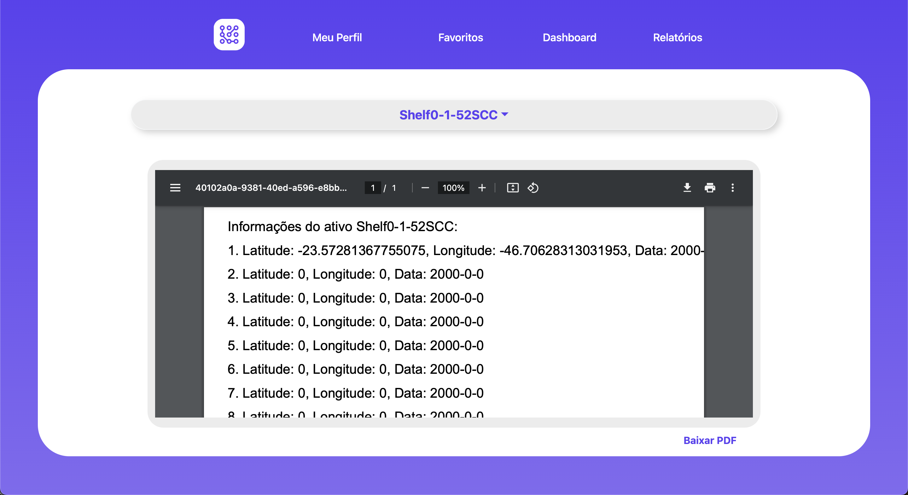
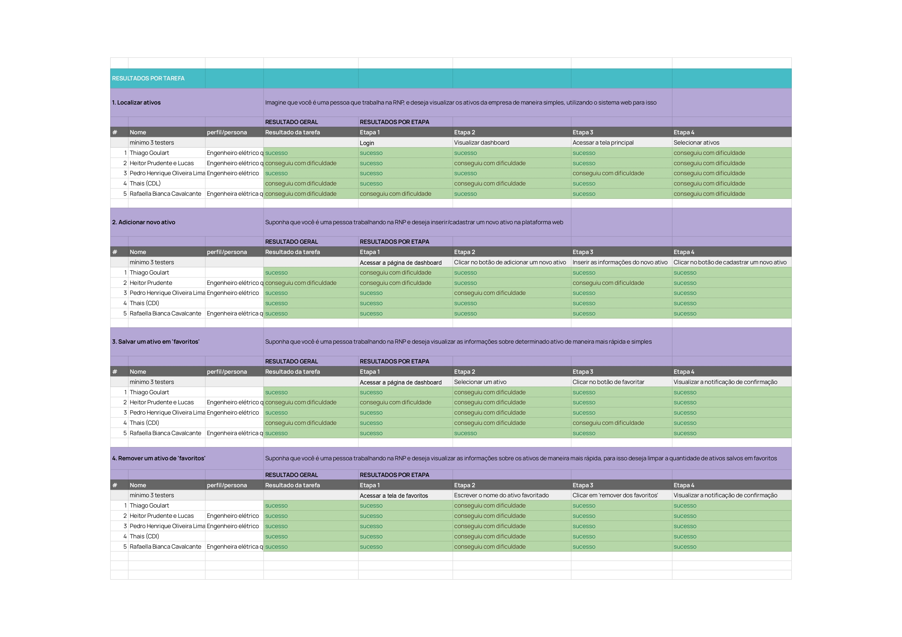

 # Documentação IoTDoc - Módulo 4 - Inteli

 

## Grupo - Connect4

## Projeto - GeoLoc

## Integrantes do grupo

- <a href="https://www.linkedin.com/in/antonio-guimarães-2bb961264/">Antonio Artimonte Vaz Guimarães</a>
- <a href="https://www.linkedin.com/in/fernando-machado-84673a212/">Fernando Machado dos Santos</a>
- <a href="https://www.linkedin.com/in/joão-paulo-da-silva-a45229215/">João Paulo Da Silva</a>
- <a href="https://www.linkedin.com/in/matheusmeendes/">Matheus Ferreira Mendes</a> 
- <a href="https://www.linkedin.com/in/omatheusrsantos/">Matheus Ribeiro dos Santos</a> 
- <a href="https://www.linkedin.com/in/ólin-medeiros-costa-b0a1b426a/">Ólin Costa</a>
- <a href="https://www.linkedin.com/in/rodrigo-sales-07/">Rodrigo Sales Freire dos Santos</a> 

## Sumário

[1. Introdução](#c1)

[2. Metodologia](#c2)

[3. Desenvolvimento e Resultados](#c3)

[4. Possibilidades de Descarte](#c4)

[5. Conclusões e Recomendações](#c5)

[6. Glossário](#c6)

[7. Referências](#c7)

 

# 1. Introdução

 
&emsp;&emsp;Neste documento, apresentaremos o projeto desenvolvido para a Rede Nacional de Ensino e Pesquisa (RNP), uma grande instituição na área educacional e de pesquisa no Brasil. A RNP, com seu amplo alcance e atuação em todo o país, desempenha um papel crucial no fornecimento de serviços de <i>internet</i> segura e de alta capacidade, bem como na promoção de projetos inovadores no setor.

 
&emsp;&emsp;A RNP enfrenta um desafio significativo relacionado à gestão e rastreamento de seus ativos distribuídos por todo o território brasileiro. As dificuldades em detalhar, vincular, controlar e manter visibilidade sobre esses ativos podem resultar em uma série de problemas operacionais. Isso inclui perda de ativos, desperdício de recursos, aumento dos custos de manutenção e substituição, além de complicações no planejamento estratégico do estoque de ativos. Para solucionar esses desafios, a RNP busca uma solução que permita a localização e identificação eficaz de seus ativos, rastreando sua localização geográfica em tempo real e fornecendo informações precisas sobre seu status e histórico de movimentação.

 
&emsp;&emsp;Ao longo deste documento, detalharemos o projeto de <i>IoT</i> para localização de ativos da RNP. Abordaremos as etapas, metodologias e expectativas de resultados, visando oferecer uma compreensão clara da importância do projeto e como ele aprimorará as operações da RNP, otimizando a gestão de ativos em toda a organização e contribuindo para um serviço mais eficiente. 

## 1.1 Objetivos

&emsp;&emsp;A Rede Nacional de Ensino e Pesquisa (RNP) tem como objetivo geral fortalecer a infraestrutura tecnológica do Brasil, promovendo inovação, conectividade segura e de alta capacidade para instituições acadêmicas e científicas em todo o país. A organização busca facilitar o acesso à <i>internet</i> e promover projetos de pesquisa, além de fornecer serviços personalizados que atendam às necessidades específicas das instituições de ensino e pesquisa, contribuindo assim para o avanço da educação e pesquisa no Brasil.

 
&emsp;&emsp;No contexto do projeto de <i>IoT</i> em questão, os objetivos específicos da RNP se concentram na implementação de um sistema eficaz de localização de ativos distribuídos pelo Brasil. Isso envolve aprimorar a gestão desses ativos, fornecer informações atualizadas para melhor atendimento ao cliente, facilitar o planejamento estratégico e prevenir perdas e roubos de ativos. Esses objetivos específicos têm como finalidade aperfeiçoar a eficiência operacional da RNP, garantir o uso eficaz dos recursos e, consequentemente, promover o avanço da educação e pesquisa no país. 

## 1.2 Proposta da solução

&emsp;&emsp;A proposta de solução para o projeto de <i>IoT</i> da RNP se baseia na implementação de um sistema de rastreamento eficiente para seus ativos geograficamente distribuídos em todo o Brasil. Esse sistema empregará dispositivos de Internet das Coisas (<i>IoT</i>) para coletar dados em tempo real sobre a localização e o status dos ativos.

&emsp;&emsp;Por meio da tecnologia <i>IoT</i>, a solução permitirá à RNP: 

1. Rastrear ativos em tempo real: Utilizando dispositivos de <i>IoT</i>, os ativos da RNP serão rastreados continuamente, fornecendo informações precisas e atualizadas sobre sua localização.

2. Centralizar o controle: Um painel de controle centralizado será disponibilizado para a equipe da RNP, proporcionando uma visão completa dos ativos, incluindo detalhes sobre seu estado, histórico e movimentações.

3. Facilitar o atendimento ao cliente: A equipe poderá acessar rapidamente as informações de localização dos ativos, o que agilizará o atendimento às demandas dos clientes e otimizará o planejamento estratégico.

4. Otimizar o uso de recursos: A solução ajudará a RNP a otimizar a alocação de recursos, pois fornecerá dados precisos para o planejamento estratégico.

5. Prevenir perdas e roubos: O rastreamento contínuo e as informações em tempo real contribuirão para a prevenção de perdas e roubos de ativos valiosos. 

 
&emsp;&emsp;Em suma, a solução de <i>IoT</i> visa resolver o problema da RNP em relação ao rastreamento e gerenciamento de ativos, atendendo aos objetivos de melhorar a eficiência operacional, fornecer um melhor atendimento ao cliente e garantir o uso eficaz de recursos. Isso contribuirá para o fortalecimento da infraestrutura tecnológica do Brasil, promovendo inovação e conectividade de alta capacidade para instituições acadêmicas e científicas em todo o país. 

## 1.3 Justificativa

&emsp;&emsp;A proposta de solução para o projeto de IoT da RNP apresenta inúmeras vantagens e benefícios significativos. Primeiramente, a implementação de um sistema de rastreamento de ativos baseado em IoT tem o potencial de revolucionar a forma como a RNP gerencia seus equipamentos geograficamente distribuídos em todo o Brasil. Aqui estão algumas das principais razões pelas quais nossa solução se destaca:

1. Rastreamento contínuo: Nossa solução oferece rastreamento contínuo dos ativos, proporcionando à RNP uma visão completa da localização e do status de cada equipamento. Isso elimina a necessidade de processos manuais demorados e propensos a erros.

2. Aumento da eficiência operacional: Ao fornecer informações em tempo real, nossa solução permite que a equipe da RNP otimize a alocação de recursos e melhore o planejamento estratégico. Isso resultará em uma operação mais eficiente e em uma economia de recursos.

3. Atendimento ao cliente aprimorado: Com acesso rápido e preciso às informações de localização dos ativos, a RNP poderá atender de forma mais eficiente às necessidades de seus clientes. Isso contribui para a satisfação do cliente e fortalece os relacionamentos comerciais.

4. Prevenção de perdas e roubos: A capacidade de rastrear ativos em tempo real ajuda a prevenir perdas e roubos, protegendo os investimentos da RNP e economizando recursos que seriam necessários para substituir equipamentos perdidos.

5. Dados para tomada de decisão: Nossa solução fornece dados valiosos que podem ser usados para tomadas de decisões estratégicas. A RNP poderá analisar o histórico de movimentação de ativos e usar essas informações para melhorar seus processos internos e planejamento.

6. Inovação tecnológica: A implementação de tecnologia <i>IoT</i> para rastreamento de ativos representa uma inovação significativa para a RNP. Isso demonstra o compromisso da organização em manter-se na vanguarda da tecnologia, promovendo o avanço da educação e pesquisa no Brasil.

&emsp;&emsp;Em resumo, nossa proposta de solução é vantajosa para a RNP, oferecendo melhorias operacionais, prevenção de perdas, atendimento ao cliente aprimorado e a capacidade de tomar decisões informadas. Nossa solução se diferencia por ser uma abordagem tecnologicamente avançada para a gestão de ativos, alinhando-se perfeitamente com os objetivos da RNP de fortalecer a infraestrutura tecnológica do Brasil e promover a inovação no campo da educação e pesquisa. 

# 2. Metodologia

&emsp;&emsp;Na abordagem acadêmica da nossa instituição (Inteli), a metodologia desempenha um papel fundamental no processo educacional, primordialmente no desenvolvimento de projetos (Project-based learning), através de métodos pedagógicos inovadores e uma abordagem prática. Nesse contexto, exploramos o <i>RM-ODP</i> (Modelo de Referência para Processamento Distribuído Aberto) como uma estrutura essencial neste projeto. O <i>RM-ODP</i> oferece uma base sólida para a organização e gestão de projetos de sistemas com processamento distribuído, incorporando a descrição formal para especificidades relacionadas à arquitetura. Esta metodologia, alinhada com os princípios da nossa instituição, oferece uma estrutura robusta para a compreensão e desenvolvimento de sistemas distribuídos.

&emsp;&emsp;<i>RM-ODP</i> é uma sigla que, em português, significa “Modelo de Referência para Processamento Distribuído Aberto”. Trata-se de um modelo de referência baseado em conceitos de organização e gestão de projeto de sistemas com processamento distribuído e na descrição formal  para especificidades relacionadas a arquitetura. 

 
Figura 01 - <i>RM-ODP</i>  
</img>  
Fonte: [Wikipedia](https://en.wikipedia.org/wiki/RM-ODP#/media/File:RM-ODP_viewpoints.jpg)
 

&emsp;&emsp;O <i>framework</i> se baseia em princípios de negócio bem definidos, que norteiam todo o desenvolvimento posterior que segue com: visão de requisitos funcionais e não funcionais, arquitetura da solução e tecnologia. A seguir vamos abordar os métodos. 

> “O propósito o ponto de vista da empresa deve especificar a perspectiva do negócio e do ambiente empresa onde será contemplado o sistema, o ponto de vista de informação é responsável por determinar a semântica da informação pertinente ao escopo, o ponto de vista de computação centra-se nas funcionalidades sistêmicas, o ponto de vista de engenharia foca na distribuição do sistema e o ponto de vista de tecnologia determina os produtos de <i>hardware</i> e <i>software</i> utilizados como infraestrutura.”  
SANTOS, 2012.

&emsp;&emsp;A visão de negócios engloba a parte mais importante do entendimento para o desenvolvimento do projeto, pois é responsável pelo entendimento das demandas que o projeto atende, bem como as necessidades dos <i>stakeholders</i>. Todo o desenvolvimento é viabilizado nesse momento, pois ao aplicar a visão de negócios no contexto <i>RM-ODP</i>, ela atua como um guia estratégico.

&emsp;&emsp;O guia para o atendimento das necessidades e expectativas das funcionalidades do sistema é responsabilidade da etapa de requisitos funcionais. Ao aplicar a visão de requisitos funcionais no <i>RM-ODP</i>, é possível definir claramente as funções e operações que cada componente distribuído deve realizar. Isso ajuda a garantir que o sistema atenda às expectativas e necessidades dos usuários finais, contribuindo para a eficácia global do projeto.

&emsp;&emsp;Agora, os aspectos críticos que não se limitam às funcionalidades, mas também abrangem características como desempenho, segurança, escalabilidade e usabilidade, são abordadas na visão de requisitos não funcionais. Essa visão foca principalmente na qualidade e desempenho do sistema distribuído, questões como: tempo de resposta, disponibilidade, entre outros. Com isso, torna-se evidente a importância de requisitos não funcionais em sistemas interconectados, são aspectos sobre como o sistema deve executar as suas funcionalidades.

&emsp;&emsp;A visão de arquitetura auxilia os desenvolvedores a definir a estrutura organizacional do sistema identificando os componentes principais, de maneira agnóstica a tecnologia e maiores detalhamentos, a forma como se conectam (inter-relações) e as interfaces entre eles. Isso faz-se muito importante para garantir que todos os elementos distribuídos trabalham de maneira harmoniosa para atender os requisitos do projeto.

&emsp;&emsp;As especificações relacionadas a tecnologia e os protocolos de comunicação entre eles, fazem parte da visão de tecnologia do <i>RM-ODP</i>. É de suma importância as especificações detalhadas dos componentes do sistema para que fique claro a forma de implementação e interconexão alinhados com os objetivos do projeto. Essa metodologia estruturada contribui significativamente para o sucesso e eficiência no desenvolvimento de sistemas distribuídos. 

# 3. Desenvolvimento e Resultados 

&emsp;&emsp;O seguinte tópico proporciona uma visão abrangente das análises de negócios realizadas pelo grupo, destacando a compreensão profunda das necessidades e requisitos dos usuários finais. Este segmento documenta não apenas as análises de mercado e as considerações estratégicas, mas também explora a criação e definição de personas, <i>user stories</i> e <i>storyboards</i> que orientaram o desenvolvimento do projeto. Além disso, apresenta as arquiteturas fundamentais que sustentam o sistema, fornecendo uma compreensão detalhada das estruturas e tecnologias utilizadas para concretizar as funcionalidades do sistema de rastreamento de ativos.

## 3.1. Domínio de Fundamentos de Negócio

&emsp;&emsp;O tópico de Domínio de Fundamentos de Negócio abrange uma gama de modelos e análises estratégicas fundamentais para a compreensão do projeto e da RNP em si. Ele incorpora modelos clássicos, como as 5 Forças de Porter e a Análise <i>SWOT</i>, oferecendo uma perspectiva detalhada sobre os cenários competitivos e os pontos fortes e fracos do sistema proposto. Além disso, esse segmento engloba a Matriz de Risco do Projeto, o <i>Value Proposition Canvas</i> (<i>VPC</i>), a adequação à Lei Geral de Proteção de Dados (LGPD), além de uma descrição abrangente da solução proposta e o detalhamento do <i>Bill Of Materials</i> (<i>BOM</i>), proporcionando uma visão holística e estratégica do projeto em seu contexto de negócios.

### 3.1.1. Contexto da Indústria

&emsp;&emsp;A Matriz de 5 Forças de Porter é um análise de mercado que visa a análise completa do ambiente que cerca a área de atuação da empresa estudada. Neste aspecto, compreende o poder dos consumidores e fornecedores, rivalidade entre concorrentes existentes, ameaça de novos entrantes e ameaça de surgimento de produtos substitutos. Desta maneira, pode-se compreender como a relação entre diferentes componentes constroem uma vertente de mercado. Em relação à RNP, as 5 forças foram descritas de acordo com os três seguimentos principais da empresa: pesquisa, projetos e serviços. 
  
&emsp;&emsp;O Connect4, seguindo os objetivos propostos acima, descreveu abaixo uma Matriz de 5 Forças (figura 02).

 
Figura 02  
</img>  
Fonte: elaborado pelos autores
 

&emsp;&emsp; O documento criado acima compreende que, como nivelamento das forças de cada uma das áreas de mercado exploradas, que o poder dos fornecedores é baixo para a área de serviços e de projetos, vide que a RNP tem potencial para ser sua auto fornecedora. Já na área de pesquisa, por outro lado, a requisição de equipamentos operacionais faz com que o poder dos fornecedores neste âmbito seja médio. Quanto à ameaça de novos entrantes, esta se considera baixa no setor de serviços e pesquisa, que são áreas fortemente estabelecidas e que requerem uma certa credibilidade anterior. Em projetos, por outro lado, esta é média, haja vista que existe uma possibilidade de empresas surgirem com este propósito. Produtos substitutos, por sua vez, constitui-se majoritariamente por baixos poderes, tendo em consideração que a substituição destes produtos essenciais seja demasiadamente complexa. Os compradores, entretanto, apresentam poder elevado, principalmente na área de serviços e de projetos, pois é demandado um comprador/cliente final para a realização destes. A concorrência, finalmente, é média, pois existem outros fornecedores que possam desenvolver pesquisas (como a Capes, por exemplo) e financiem a área, além de que existem muitas empresas disponíveis no mercado que trabalhem justamente com a área de projetos.

#### 3.1.1.1. Concorrência

&emsp;&emsp;A RNP atua em um nicho bastante específico de mercado. A sua principal frente, de redes de <i>internet</i>, foca nas universidades e centros de pesquisa, já que ela vem acompanhada de um pacote de benefícios, que incluem sites educacionais, entre outros bônus. Por conta disso, a RNP apresenta um diferencial para as instituições de ensino que a destaca fortemente de outras fornecedoras de fibra óptica, como a V.Tal e a Fibrasil. Ainda por cima, o contrato com as universidades é garantida pelo governo, o que assegura uma certa estabilidade para a RNP. Já nas frentes de pesquisa e projetos, a concorrência é mais relevante. Existem outros centros de pesquisa, como por exemplo o IPT, que apresentam estrutura de ponta e alta capacitação técnica, e por isso conseguem oferecer serviços de alta qualidade, e assim apresentam uma verdadeira ameaça para a RNP. 

&emsp;&emsp;Entretanto, a parceria com o governo mitiga essa ameaça, e o alto orçamento proveniente dessa colaboração garante uma ampla gama de clientes para a RNP, e por isso torna essa concorrência irrelevante. Por fim, a RNP apresenta uma natureza sem fins lucrativos, o que é outro fator que diminui a importância dos seus concorrentes, já que o foco deles não é na captação de capital. Esse aspecto também facilita a criação de laços com empresas de setores semelhantes, permitindo parcerias que tornam a ameaça dos concorrentes em oportunidades. A Oi, por exemplo, se uniu à RNP para garantir a ampliação do cabeamento de fibra óptica pelo Brasil. Portanto, apesar de ter alguns concorrentes, como a V.Tal, Fibrasil e IPT, a RNP apresenta uma forte vantagem competitiva que a coloca na frente dos seus semelhantes. 

#### 3.1.1.2. Ameaça de produtos substitutos

&emsp;&emsp;Por conta da parceria com as empresas de fibra ótica e com as universidades federais, garantida pelo governo, o setor de <i>internet</i> da RNP apresenta uma baixa ameaça de produtos substitutos, pois apresenta uma garantia extra de continuidade de serviços fornecida pelos órgãos públicas e empresas privadas. Já a área de pesquisa e projetos podem ser substituídas por serviços dos concorrentes, porque existem outras empresas que realizam este serviço, como a FAPESP, o CNPEM e muitas outras. Caso as empresas que buscam a RNP sintam-se insatisfeitas com os seus serviços, elas podem procurar outros produtos, como por exemplo aqueles ofertados pelo IPT.

#### 3.1.1.3. Poder dos compradores 

&emsp;&emsp;No âmbito da fibra ótica, os contratos da RNP são garantidos pelo governo. Assim, a parceria com as universidades federais é praticamente assegurada, e por isso eles não apresentam poder de barganha. Os compradores apresentam maior poder de barganha no âmbito dos projetos, pois podem, sem problemas, procurar outras empresas do setor que podem oferecer produtos parecidos. Além disso, como muitos deles são feitos para empresas privadas, o acordo não é garantido. Assim, caso as empresas não achem a proposta da RNP atraente, tanto pelo preço quanto pela qualidade do serviço, podem procurar outros produtos semelhantes. O mesmo acontece para a parte de pesquisa, já que existem outras empresas que também conduzem estudos semelhantes, como a FAPESP, o CNPEM, novamente, e por isso os compradores possuem opção de procurar produtos substitutos. 

#### 3.1.1.4. Ameaça de novos entrantes

&emsp;&emsp;O mercado de atuação da RNP requer um alto investimento inicial em infraestrutura e equipamentos. Os investimentos no setor de fibra ótica podem chegar na ordem dos bilhões, já que eles atuam em todo o Brasil. No setor de pesquisa, é necessário uma equipe com alto grau de especialização, assim como equipamentos de ponta para garantir o avanço da pesquisa. Além disso, o mercado já é bastante consolidado, com empresas com décadas de atuação e experiência. Assim, mesmo que uma nova empresa tentasse entrar nessa área, seria difícil conseguir uma fatia satisfatória do mercado, que justificasse os altos investimentos feitos. A área de projetos é a mais passível de sofrer alguma substituição por produtos semelhantes, já que requer apenas uma equipe ténica com certa especialização para conduzir esses programas. 

#### 3.1.1.5. Poder dos fornecedores 

&emsp;&emsp;A RNP garante uma produção in-house dos cabos de fibra ótica, e por isso não dependem de nenhum fornecedor especializado, apenas de matéria-prima. A dependência mais preocupante é a dos equipamentos de pesquisa, que precisam ser de alta tecnologia para garantir um avanço das investigações. Além disso, a parceria com o governo facilita o contato com os fornecedores e também o financiamento dos seus produtos. Logo, para a área de serviços de Internetos os fornecedores não apresentam um poder relevante para a RNP. Já para a área de pesquisa eles apresentam uma certa relevância, já que nesse setor eles necessitam equipamentos especializados para conduzir seus experimentos. Assim, é preciso ir atrás de fornecedores também especializados, e por isso são mais concentrados. A área de projetos, por sua vez, depende da equipe técnica da RNP, e não de fornecedores externos, e por isso não apresentam relevância. 

### 3.1.2. Análise _SWOT_

&emsp;&emsp;A análise <i>SWOT</i> é uma ferramenta essencial para a avaliação estratégica de uma empresa, permitindo uma compreensão holística do ambiente interno e externo que impacta seu desempenho e futuro. Ela identifica os pontos fortes e as fraquezas internas da empresa, bem como as oportunidades e ameaças externas que podem afetar seu posicionamento no mercado. Do ponto de vista de um projeto específico, a análise <i>SWOT</i> facilita a definição de objetivos e estratégias, direcionando os esforços para atender às necessidades do cliente e adaptando abordagens para lidar com as fraquezas e ameaças identificadas. 

&emsp;&emsp;Ao destacar as sinergias e oportunidades, a análise <i>SWOT</i> ajuda a minimizar riscos, aprimorar a comunicação e avaliar os resultados do projeto. Essa abordagem é fundamental para garantir que o projeto atenda de maneira eficaz às necessidades do cliente e conduza a um resultado bem-sucedido. No contexto específico do projeto com a RNP, a Figura 03 apresenta visualmente os <i>insights</i> e considerações do grupo em relação à análise <i>SWOT</i>, fornecendo um panorama claro das características internas e externas que podem influenciar o desenvolvimento e a implementação da solução proposta. 

 

Figura 03 - Análise <i>SWOT</i>  
</img> 
Fonte: elaborado pelos autores.

 

&emsp;&emsp;A análise <i>SWOT</i> revela um panorama detalhado da situação atual da RNP, evidenciando seus pontos fortes, fraquezas, oportunidades e ameaças no mercado em que atua. A empresa possui uma força considerável em sua equipe altamente qualificada e em suas parcerias estratégicas com o governo e instituições de ensino relevantes. Além disso, a independência de fornecedores externos para a obtenção de matéria-prima reforça sua estabilidade operacional.

&emsp;&emsp;Entretanto, a RNP enfrenta desafios significativos, como a falta de investimento em estratégias de <i>marketing</i> e a instabilidade de alguns serviços, além da dependência de parcerias para a infraestrutura em nuvem e a necessidade de um maior cuidado técnico e gerenciamento de ativos. Porém, o cenário oferece oportunidades interessantes, como a expansão do programa Internet Brasil, parcerias internacionais para pesquisa e a implantação de infraestrutura de infovias no norte e nordeste do Brasil.

&emsp;&emsp;Apesar das oportunidades promissoras, a empresa está sujeita a ameaças como cortes nos investimentos governamentais em pesquisa. Contudo, sua posição no mercado é reforçada pela sua excelência, independência e pela elevada barreira de entrada. A RNP mantém uma posição competitiva e sustentável, tornando-se um ponto de referência no setor, onde a concorrência é minimizada e as barreiras para novos competidores são consideráveis.

### 3.1.3. Descrição da Solução a ser Desenvolvida

&emsp;&emsp;O seguinte tópico concentra-se em fornecer uma compreensão holística do problema a ser resolvido e na proposta de uma solução alinhada às necessidades identificadas. Inicia-se com uma análise aprofundada do problema em questão, delineando suas nuances e desafios específicos. Em seguida, apresenta-se a solução proposta, destacando sua visão de negócios e os objetivos que visa alcançar. Detalha-se também como a solução será empregada no contexto de uso, ressaltando suas funcionalidades e a interação esperada com os usuários finais. 

&emsp;&emsp;Também aborda-se os benefícios advindos da implementação da solução são destacados, enfatizando as melhorias esperadas no cenário atual e os impactos positivos para os stakeholders envolvidos. A definição do critério de sucesso é essencial nesta fase, indicando claramente os parâmetros que serão utilizados para avaliar a eficácia e o desempenho da solução proposta. Este tópico, portanto, proporciona uma visão estratégica e abrangente da solução, estabelecendo as bases para o sucesso do projeto e alinhando as expectativas de seus resultados com as necessidades dos usuários e das partes interessadas.

#### 3.1.3.1 Qual é o problema a ser resolvido

&emsp;&emsp;O problema a ser resolvido é a falta de visibilidade e controle eficaz sobre a localização e o estado dos ativos distribuídos em todo o território brasileiro pela RNP. Atualmente, a organização enfrenta desafios em rastrear, entender o estoque e obter informações específicas sobre seus ativos. Essa falta de visibilidade pode levar a processos operacionais ineficientes, alocação inadequada de recursos, perdas e roubos de ativos e dificuldades no atendimento ao cliente.

#### 3.1.3.2 Qual a solução proposta (visão de negócios)

&emsp;&emsp;A solução proposta é a implementação de um sistema de rastreamento de ativos baseado em <i>IoT</i>. Esse sistema permitirá que a RNP acompanhe em tempo real a localização e o status de seus ativos, fornecendo uma visão completa e atualizada de todos os equipamentos distribuídos pelo país. A solução envolve o uso de dispositivos <i>IoT</i>, sensores e uma plataforma de gerenciamento de dados que permitirá à RNP coletar, analisar e visualizar informações importantes sobre seus ativos.

#### 3.1.3.3 Como a solução proposta deverá ser utilizada

&emsp;&emsp;A solução proposta será utilizada como uma ferramenta de suporte à gestão de ativos da RNP. Os dispositivos <i>IoT</i> e sensores serão instalados nos ativos da organização, transmitindo informações de localização e <i>status</i> para a plataforma de gerenciamento de dados. Os funcionários da RNP poderão acessar essa plataforma para rastrear ativos, analisar dados, tomar decisões estratégicas, otimizar alocações de recursos e atender às necessidades dos clientes de forma eficiente.

#### 3.1.3.4 Quais os benefícios trazidos pela solução proposta

&emsp;&emsp;A solução proposta para o projeto apresenta uma gama diversificada de benefícios que impactam diretamente o desempenho e a eficácia das operações da RNP:

1. <b>Rastreamento eficiente de ativos em tempo real:</b> Permite o acompanhamento contínuo e preciso da localização dos ativos, proporcionando uma visão detalhada do seu movimento em tempo real.

2. <b>Aprimoramento na gestão de ativos:</b> Facilita uma gestão mais eficaz, oferecendo informações precisas sobre a localização, condição e utilização dos ativos, permitindo uma alocação mais eficiente dos recursos.

3. <b>Tomada de decisões estratégicas com base em informações precisas</b> Oferece dados confiáveis para embasar decisões estratégicas, melhorando a eficiência operacional e orientando ações futuras com maior embasamento.

4. <b>Atendimento ao cliente aprimorado:</b> Facilita o acesso a informações relevantes sobre a localização de ativos, o que pode resultar em resolução de problemas mais rápida e eficiente para os clientes.

5. <b>Prevenção de perdas e roubos de ativos:</b> Ao monitorar constantemente a localização dos ativos, a solução reduz a probabilidade de perdas e roubos, aumentando a segurança dos recursos da empresa.

6. <b>Demonstração de inovação tecnológica:</b> Reflete a capacidade da RNP em adotar tecnologias avançadas para melhorar suas operações, reforçando sua posição como uma instituição inovadora.

7. <b>Manutenção da relevância contínua da RNP:</b> Ao implementar soluções tecnológicas eficazes e atualizadas, a RNP mantém sua competitividade e relevância no mercado, atendendo às demandas em constante evolução.

&emsp;&emsp;Esses benefícios compõem um conjunto de vantagens que não apenas melhoram a eficiência operacional da RNP, mas também fortalecem sua posição no mercado, garantindo que a organização esteja alinhada com as expectativas e necessidades em um ambiente empresarial em constante transformação.

#### 3.1.3.5 Qual será o critério de sucesso e qual medida será utilizada para o avaliar

&emsp;&emsp;O sucesso da solução proposta será avaliado através de uma série de indicadores chave, fundamentais para medir o desempenho e a eficácia do sistema implementado. Esses indicadores incluem:

1. <b>Precisão das Informações de Localização:</b> Avalia a exatidão e confiabilidade das informações de localização dos ativos, verificando a acuracidade das coordenadas fornecidas pelo sistema.

2. <b>Eficiência dos Processos Operacionais:</b> Mede a melhoria na eficiência e na produtividade das operações, comparando processos anteriores com aqueles executados após a implementação da solução.

3. <b>Prevenção de Perdas e Roubos de Ativos:</b> Analisa a capacidade da solução em minimizar a ocorrência de perdas e roubos de ativos, fornecendo medidas preventivas e reativas.

4. <b>Satisfação dos Clientes:</b> Reflete a satisfação e a resposta dos clientes em relação à qualidade e ao desempenho do serviço prestado após a implementação da solução.

5. <b>Redução de Custos Operacionais:</b> Avalia a capacidade da solução em otimizar processos, reduzir desperdícios e, consequentemente, diminuir os custos operacionais da RNP.

6. <b>Relevância Contínua da Solução ao Longo do Tempo:</b> Verifica se a solução continua a atender às demandas e necessidades em evolução da RNP ao longo do tempo, adaptando-se e mantendo sua utilidade.

&emsp;&emsp;A avaliação será realizada por meio da análise e comparação desses indicadores, assegurando que a solução atenda não apenas aos objetivos estabelecidos, mas também que proporcione benefícios concretos e mensuráveis para a organização, contribuindo para seu sucesso contínuo.

### 3.1.4. _Value Proposition Canvas_  

&emsp;&emsp;O Canvas de Proposta de Valor é uma ferramenta essencial para estruturar e comunicar os elementos fundamentais que compõem a proposta de valor de um projeto ou empresa para seus clientes. Ao delinear de forma clara e concisa como a organização planeja resolver os problemas e satisfazer as necessidades de um segmento específico de clientes, essa ferramenta se torna crucial para a diferenciação de um produto ou serviço no mercado.

&emsp;&emsp;O cerne da proposta de valor reside em sua capacidade de apresentar soluções eficazes para as dores e desafios enfrentados pelos clientes. Portanto, o Canvas de Proposta de Valor oferece uma visão abrangente das promessas feitas aos consumidores, ajudando não apenas na definição, mas também na comunicação efetiva dessas promessas. Essa ferramenta tem valor tanto para a empresa quanto para os clientes, permitindo alinhar as soluções oferecidas com as reais necessidades do mercado.

&emsp;&emsp;Ao identificar as principais dores dos clientes e destacar como o projeto ou negócio pretende solucioná-las, o Canvas de Proposta de Valor torna-se um guia para a formulação de estratégias de mercado e melhoria contínua. Em suma, é uma ferramenta poderosa para uma compreensão aprofundada do público-alvo, ajustando ofertas de produtos ou serviços para fornecer um valor genuíno. Dessa forma, o Canvas de Proposta de Valor desempenha um papel crítico na construção de negócios bem-sucedidos e na satisfação contínua dos clientes. A Figura 04 apresenta a proposta de valor do grupo de forma detalhada.

 
Figura 04 - Value Proposition Canvas 
</img> 
Fonte: elaborado pelos autores.
 

&emsp;&emsp;Diante da análise detalhada dos elementos do projeto, é evidente que a solução proposta oferece um conjunto significativo de benefícios aos usuários e à empresa. Com os <i>Gains Creators</i> bem definidos, como a maior eficiência na gestão de ativos, a redução de custos administrativos e a prevenção de roubos e perdas, juntamente com os produtos e serviços oferecidos, como o sistema <i>IoT</i> para localização geográfica sob demanda e o dashboard abrangente, torna-se evidente que os <i>Customer Jobs</i> são plenamente atendidos.

&emsp;&emsp;Os <i>Gains</i> são facilmente identificáveis ao permitir consultas em tempo real sobre os ativos, aumentar a precisão na identificação e localização, agilizar tomadas de decisão e reduzir desperdício financeiro. Por outro lado, os <i>Pain Relievers</i> evidenciam a resolução de problemas com dificuldades na localização geográfica dos ativos, perdas financeiras e desperdício de recursos.

&emsp;&emsp;Portanto, a solução proposta não apenas atende às necessidades dos usuários em localizar, monitorar e gerenciar ativos em tempo real pelo Brasil, mas também oferece uma gama de benefícios que otimizam processos, reduzem desperdícios e ampliam a eficiência na utilização e gestão de ativos, demonstrando um produto robusto e eficaz para as demandas atuais do mercado.

### 3.1.5. Matriz de Riscos

&emsp;&emsp;A Matriz de Riscos (figura 05 e 06) é uma análise que busca compreender uma maioridade de riscos que permeiam o desenvolvimento do projeto, avaliando seu impacto sobre a produção e a chance de sua ocorrência. Desta maneira, pode-se evitar que problemas futuros acabem por atrapalhar o ambiente de trabalho como um todo.  
&emsp;&emsp;O Connect4, seguindo os objetivos propostos acima, descreveu abaixo uma Matriz de Riscos que segue sendo progressivamente atualizada. 

 
Figura 05 - Matriz de Riscos - parte 1 
</img>
 
Fonte: elaborado pelos autores.
 
Figura 06 - Matriz de Riscos - parte 2  
</img>
 
Fonte: elaborado pelos autores.
 

&emsp;&emsp; Sendo direto, as informações acima foram constantemente adaptadas com o decorrer do projeto, buscando concentrar todas as possíveis falhas e problemas que permeiam e permearam o desenvolvimento do projeto ao longo do tempo. Pensando nisto, são informações que compreendem legitimamente as questões da equipe Connect4, não necessariamente impactando a solução entregue.   

### 3.1.6. Política de Privacidade de acordo com a LGPD<!--  -->

&emsp;&emsp; As seções que se seguem apresentam a política de privacidade organizada pela equipe Connect4 em interlúdio com sua solução (GeoLoc) e prevêem o tratamento das informações fornecidas, compondo quais suas opções de salvamento, exclusão e utilização, além, é claro, do procedimento necessário para a anulação de dados pessoais indevidos. 

#### 3.1.6.1 Informações gerais sobre a empresa / organização

&emsp;&emsp;O Connect4, em conjunto com a Rede Nacional de Ensino e Pesquisa, é responsável pelo tratamento de dados, sensíveis também, do usuário. A empresa atua na área de pesquisa e educação, desenvolvendo serviços que visam estimular a disponibilidade de internet segura e de alta capacidade, serviços personalizados e promover projetos de inovação.

#### 3.1.6.2 Informações sobre o tratamento de dados

&emsp;&emsp;A RNP e o Connect4 baseiam todas as atividades que realizam algum tipo de tratamento de dados pessoais seguindo os seguintes princípios:

a) Finalidade: só realizamos o tratamento de qualquer dado pessoal para atender a finalidades específicas e determinadas para realizar a operação de nossos serviços;  
b) Necessidade: limitamos o processamento de dados pessoais somente ao estritamente necessário para o atendimento das finalidades previamente definidas;  
c) Adequação: garantimos que o tratamento dos dados pessoais na operação de nossos serviços seja totalmente compatível com as finalidades previamente definidas;  
d) Transparência: garantimos que você seja informado de forma clara e transparente sobre todas as operações de tratamento de dados pessoais realizados pela RNP e Connect4 e, eventualmente, por parceiros e fornecedores;  
e) Qualidade: trabalhamos para que os dados pessoais tratados pela RNP e Connect4 sejam verídicos e estejam sempre corretos e atualizados;  
f) Segurança: aplicamos medidas técnicas e administrativas necessárias para garantir a proteção dos seus dados pessoais;  
g) Prevenção: aplicamos medidas para evitar a ocorrência de qualquer situação acidental ou ilícita de destruição, perda, alteração, comunicação ou acesso não autorizado; 
h) Não-discriminação: nunca iremos realizar o tratamento de dados pessoais para discriminar pessoas ou com finalidades ilícitas e abusivas; 
i) Livre acesso: asseguramos o exercício dos seus direitos, tais como acesso a todos os seus dados pessoais dos quais a RNP, Connect4 e parceiros processam, a anonimização, bloqueio e eliminação dos dados. 
j) Responsabilização e prestação de contas: adotamos medidas para demonstrar as ações implementadas para o cumprimento das legislações aplicáveis. 

#### 3.1.6.3 Quais são os dados coletados

&emsp;&emsp;Coletamos uma variedade de dados, incluindo informações de identificação pessoal, como nome, endereço e número de telefone, dados de localização, informações do dispositivo utilizado para acessar nossa aplicação, bem como informações sobre o uso da aplicação pelos usuários. Dados anônimos ou agregados. Outras informações que não revelem especificamente a sua identidade ou que não são diretamente relacionadas a um indivíduo são também coletadas, tais como informações sobre navegador e dispositivo; e dados de uso da aplicação. 

#### 3.1.6.4 Onde os dados são coletados 

&emsp;&emsp;Os dados são coletados diretamente por meio de nossa aplicação <i>IoT</i> de rastreio de ativos, que é o principal ponto de interação dos usuários com nossos serviços. Além disso, a aplicação desenvolvida para a visualização destes dados obtidos requere informações básicas relacionadas à conectividade <i>web</i> e identificações digitais.

#### 3.1.6.5 Para quais finalidades os dados serão utilizadas

&emsp;&emsp;Os dados coletados têm várias finalidades, incluindo o rastreamento de ativos, a melhoria da experiência do usuário, a comunicação com os usuários, o fornecimento de suporte e o cumprimento de obrigações legais e regulamentações.

#### 3.1.6.6 Onde os dados ficam armazenados 

&emsp;&emsp;O armazenamento dos dados são feitos e de responsabilidade da RNP e seus servidores privados. Estes, não ficam acessíveis a qualquer pessoa e se encontram armazenados em servidores particulares e de parco acesso.

#### 3.1.6.7 Qual o período de armazenamento dos dados (retenção)

&emsp;&emsp;Os dados pessoais são armazenados por um período que é estritamente necessário para cumprir as finalidades para as quais foram coletados. Após esse período, os dados são excluídos ou anonimizados. A data final para tal é o dia 22 de dezembro de 2023, que marca o fim do projeto.

#### 3.1.6.8 Uso de cookies e/ou tecnologias semelhantes

&emsp;&emsp;Na plataforma, a funcionalidade de cookies será implementada com o objetivo de assegurar a permanência do usuário logado na aplicação web. Após o usuário realizar o login, o sistema salvará o identificador único (ID) associado a esse usuário e o recuperará a cada interação, proporcionando uma experiência contínua e fluida durante a navegação, independentemente do número de cliques realizados. Essa abordagem visa otimizar a usabilidade, oferecendo praticidade ao usuário ao evitar a necessidade de efetuar login repetidamente.

#### 3.1.6.9 Com quem esses dados são compartilhados (parceiros, fornecedores, subcontratados

&emsp;&emsp;Compartilhamos dados pessoais apenas quando necessário para a operação da aplicação <i>IoT</i> de rastreio de ativos, como fornecedores de serviços de hospedagem, segurança e processamento de pagamentos. Esses terceiros são contratualmente obrigados a manter a confidencialidade e segurança das informações.

&emsp;&emsp;Os dados obtidos até o momento foram compartilhados pura e exclusivamente com as instituições parceiras. Estas são o INTELI (Instituto de Tecnologia e Liderança), que é o pivô entre as demais instituições, a Connect4, equipe desenvolvedora do produto supracitado, e a RNP, obtentora original das informações.

#### 3.1.6.10 Medidas de segurança adotadas pela Connect4 e RNP

&emsp;&emsp;Todas os dados pessoais são processados de acordo com regras de segurança da informação, que seguem os mais rigorosos padrões técnicos, como a ABNT NBR ISO/IEC 27000.

&emsp;&emsp;Dentre outras atribuições, nosso time é responsável pelo monitoramento de segurança dos nossos produtos e serviços, pela atuação em casos de incidentes de segurança, pela definição e execução de controles preventivos de segurança, de modo a verificar a conformidade com nossos padrões de controles de segurança, tanto no provimento das soluções de tecnologia, quanto no acesso aos dados pessoais sob nossa responsabilidade no desenvolvimento dos serviços a que foram contratados.

&emsp;&emsp;Nos comprometemos a empregar sempre os nossos melhores esforços para assegurar que nossos produtos e serviços funcionem com o maior nível de segurança e sem interferências, garantindo, em casos de interrupções ocasionadas por erros ou falhas, o retorno à normalidade no menor tempo possível.

&emsp;&emsp;Por fim, sempre manteremos o usuário informado em casos de ocorrência de incidentes de segurança envolvendo seus dados pessoais, especialmente aqueles que possam gerar riscos ou danos significativos. 

#### 3.1.6.11 Como a Connect4 e RNP atendeM aos direitos dos usuários

&emsp;&emsp;Estamos comprometidos em atender aos direitos dos usuários em relação aos seus dados pessoais, incluindo o acesso, correção, exclusão e outros direitos. Entre em contato conosco para obter orientações sobre como exercer esses direitos propriamente.

#### 3.1.6.12 Informações sobre como o titular de dados pode solicitar e exercer os seus direitos

&emsp;&emsp;Caso pretenda exercer qualquer um dos direitos previstos nesta Política de Privacidade e/ou nas Leis de Proteção de Dados, ou resolver quaisquer dúvidas relacionadas ao Tratamento de seus Dados Pessoais, favor contatar-nos através do <i>e-mail</i> privacidade@rnp.br.

#### 3.1.6.13 Informações de contato do encarregado de proteção de dados
&emsp;&emsp;As informações de contato são: 

a) Responsável pela Proteção de Dados: privacidade@rnp.br ; 

b) Endereço: RNP, Av. André Tosello, No. 209 - Cidade Universitária Zeferino Vaz, Campinas (SP), Brasil, CEP 13083-886.

### 3.1.7. _Bill of Material_ (BOM)

&emsp;&emsp;<i>Bill Of Materials</i> é uma descrição extensa de todos os materiais utilizados para o desenvolvimento do projeto, contabilizando o nome do componente, a quantidade destes existentes na solução, categoria em que está disposto, código dos componentes e seu valor monetário. Desta maneira, pode-se entender quais componentes são essenciais para a construção de uma versão do projeto desenvolvido, replicando-o com facilidade ou reconstruindo-o se necessário. É importante ressaltar que os componentes citados abaixo (figura 07) são referentes ao protótipo desenvolvido até o momento (1ª <i>Sprint</i>).

 
Figura 07 - Bill of Materials 
 </img> 
Fonte: elaborado pelos autores.
 

&emsp;&emsp; Todos os componentes utilizados durante a realização do protótipo físico estão descritas acima. Eles estão disponíveis na internet e são de fácil acesso. Variações nos preços podem ser encontradas dependendo do local em que se procura. Com auxílio do manual de instruções que está neste mesmo repositório do GitHub, se pode realizar a montagem completa de todo o protótipo.

## 3.2. Domínio de Fundamentos de Experiência de Usuário 

&emsp;&emsp;O domínio dos Fundamentos de Experiência de Usuário (UX) é fundamental para o desenvolvimento de produtos centrados no usuário, priorizando suas necessidades e proporcionando interações significativas. Este conjunto de práticas abrange diversos elementos essenciais, tais como a criação de personas, o mapeamento de usuários, a construção de storyboards e o desenvolvimento de user stories. A compreensão e aplicação desses conceitos formam a base para a concepção e aprimoramento de produtos e serviços que atendam de maneira eficaz e intuitiva às demandas e expectativas dos usuários finais.

### 3.2.1. Personas

&emsp;&emsp;A criação de personas desempenha um papel fundamental no desenvolvimento de soluções de Internet das Coisas (<i>IoT</i>) ao permitir uma melhor compreensão das necessidades e expectativas dos usuários finais. Ao criar personas que representam os diversos perfis de usuários, é possível obter <i>insights</i> valiosos sobre como os dispositivos <i>IoT</i> serão utilizados na prática. Isso ajuda a direcionar o desenvolvimento, tornando-o mais centrado no usuário e garantindo que as soluções atendam às demandas reais do mercado. Além disso, as personas desempenham um papel fundamental na tomada de decisões de design. Elas ajudam na priorização de recursos e funcionalidades, considerando o que é mais relevante para cada grupo de usuários. 

&emsp;&emsp;Por fim, a criação de personas também pode contribuir para uma comunicação mais eficaz entre a equipe e o cliente. Ao personificar os usuários e suas necessidades, a equipe pode se concentrar em objetivos claros e alinhar seus esforços em torno de atender às expectativas do cliente uma vez que o usuário final torna-se mais concreto. Isso ajuda a evitar mal-entendidos e conflitos internos, tornando o desenvolvimento da solução mais eficiente. Logo, abaixo temos a sequência (figuras 08, 09 e 10) de personas desenvolvidas pelo grupo para entendimento do público alvo da solução.

 
Figura 08 - Persona 01 
 </img> 
Fonte: elaborado pelos autores. 
 
Figura 09 - Persona 02 
</img>
Fonte: elaborado pelos autores. 
 
Figura 10 - Persona 03 
</img>
Fonte: elaborado pelos autores. 
 

&emsp;&emsp;A elaboração das personas representa um passo essencial no desenvolvimento de soluções de Internet das Coisas (<i>IoT</i>), permitindo um profundo entendimento das necessidades e expectativas dos usuários finais. Ao criar esses perfis representativos, adquirimos <i>insights</i> valiosos sobre a utilização prática dos dispositivos <i>IoT</i>. Essa abordagem orienta o desenvolvimento de maneira centrada no usuário, assegurando que as soluções oferecidas atendam às reais demandas do mercado.

&emsp;&emsp;As personas são essenciais na tomada de decisões de <i>design</i>, auxiliando na priorização de recursos e funcionalidades, ao considerar o que é mais relevante para cada grupo de usuários. Além disso, contribuem significativamente para uma comunicação mais eficiente entre a equipe e o cliente, permitindo a personificação das necessidades do usuário final. Isso direciona os esforços para objetivos claros, evitando mal-entendidos e conflitos internos, tornando o desenvolvimento da solução mais eficaz. Assim, a sequência de personas desenvolvidas pelo grupo (figuras 08, 09 e 10) representa um conjunto de representações dos potenciais usuários, proporcionando uma compreensão mais profunda e precisa do público-alvo da solução proposta. 

### 3.2.2. Jornadas do Usuário e Storyboard

&emsp;&emsp;A seguir, apresentamos o Mapa da Jornada do Usuário relacionado à RNP e ao nosso projeto. Esse mapa abrange todas as etapas do relacionamento entre nossos clientes e nossa organização, delineando, passo a passo, as ações que os usuários realizam e o impacto do nosso projeto sobre eles, incluindo seus sentimentos ao longo desse percurso.Este mapeamento da jornada do usuário é uma ferramenta valiosa para compreender profundamente como os clientes interagem com nossa empresa ou projeto ao longo do tempo. Ele nos permite identificar oportunidades de aprimoramento, identificar eventuais pontos de dor do cliente e, acima de tudo, aprimorar a experiência geral do usuário.

&emsp;&emsp;Neste contexto, a jornada do usuário se desdobra em diferentes etapas e pontos de contato, nos quais os clientes interagem conosco. Ao explorar em detalhes essas etapas, podemos compreender as emoções e necessidades dos usuários em cada momento, ajudando-nos a ajustar nossas estratégias e garantir que estamos entregando o máximo valor possível. Em resumo, o mapeamento da jornada do usuário é uma ferramenta crucial que nos permite criar uma experiência mais satisfatória para nossos clientes, antecipando suas necessidades e desejos ao longo de sua interação conosco. 

 
Figura 11 - Jornada do usuário  
 </img>
Fonte: elaborado pelos autores.
 

 

&emsp;&emsp;A seguir, apresentamos os <i>Storyboards</i> relacionados ao nosso projeto (figura 12, 13 e 14). Estes <i>storyboards</i> descrevem visualmente a sequência de ações e eventos que compõem a narrativa do nosso projeto, destacando as principais etapas e elementos envolvidos.O <i>storyboard</i> é uma ferramenta essencial na criação e comunicação de projetos, permitindo que todos os envolvidos tenham uma compreensão clara da narrativa, do fluxo de eventos e das interações. 

&emsp;&emsp;Neste contexto, o <i>storyboard</i> representa uma representação gráfica das cenas e ações que constituem a experiência do usuário ou a execução do projeto. Em resumo, o <i>storyboard</i> é uma representação visual que nos ajuda a mapear e comunicar a narrativa do projeto de forma clara e eficaz. Ele é uma ferramenta para garantir que nossa visão seja compreendida e implementada da maneira mais eficiente possível.

 
Figura 12 - Storyboard Wilson
 </img>
Fonte: elaborado pelos autores.
 

&emsp;&emsp;A <i>storyboard</i> relacionada à persona Wilson, Diretor de Engenharia na RNP, retrata sua interação diante do recebimento de um relatório semanal detalhado sobre a situação dos ativos do projeto de engenharia da organização. Ao iniciar seu dia na sede da RNP, Wilson verifica seu e-mail e se depara com esse relatório, que destaca pontos críticos e áreas necessitando de manutenção ou substituição de equipamentos.

&emsp;&emsp;Ao analisar o relatório, ele identifica as necessidades de investimento para manter a infraestrutura em boas condições. Em seguida, Wilson convoca uma reunião com sua equipe para discutir as decisões de investimento baseadas no relatório, definindo um plano de ação e atribuindo responsabilidades.

&emsp;&emsp;A equipe, então, inicia a implementação do plano, realizando manutenções nos ativos e adquirindo novos equipamentos, enquanto Wilson supervisiona o projeto, garantindo sua eficácia e funcionamento adequado. Essa storyboard demonstra como Wilson utiliza informações detalhadas sobre os ativos para tomar decisões estratégicas, planejar investimentos e manter a infraestrutura de engenharia da RNP em condições ideais.

 
Figura 13 - Storyboard Rafaela
</img>
Fonte: elaborado pelos autores.
 

&emsp;&emsp;Rafaela Ferreira, uma Engenheira Elétrica, desempenha o papel de acompanhar a data de vencimento de um ativo específico, crucial para a operação de um sistema. Diariamente, Rafaela verifica o estado dos ativos e acessa o dashboard da solução desenvolvida para obter informações detalhadas sobre os ativos, incluindo suas datas de vencimento.

&emsp;&emsp;Ao explorar o dashboard, ela verifica o status dos ativos e recebe notificações caso algum esteja próximo da data de vencimento. Utilizando as informações do dashboard, Rafaela gera relatórios personalizados para acompanhar as datas de vencimento dos ativos, permitindo-lhe planejar e agendar substituições conforme necessário, garantindo, assim, o funcionamento ininterrupto e eficaz do sistema sob sua supervisão.

 
Figura 14 - Storyboard Rogério
</img>
Fonte: elaborado pelos autores.
 

&emsp;&emsp;Rogério Pereira, um engenheiro com 7 anos de experiência na RNP, busca identificar a localização de um equipamento específico para assegurar o seu correto manuseio. Durante sua rotina diária na RNP, ele se depara com a necessidade de verificar a localização de um equipamento dentro de sua área de responsabilidade. Utilizando a plataforma de rastreamento desenvolvida pelo grupo, Rogério acessa informações em tempo real sobre a localização dos equipamentos monitorados.

&emsp;&emsp;Ao identificar o equipamento desejado na plataforma, ele examina sua localização atual e revisa os registros de movimento e qualquer atividade associada a ele. Caso detecte qualquer desvio nas informações de localização ou uso inadequado do equipamento, Rogério toma as medidas necessárias para garantir o manuseio adequado do equipamento.

**Conclusão:**

&emsp;&emsp;A apresentação do Mapa da Jornada do Usuário e dos <i>storyboard</i> é fundamental para compreender a interação entre os usuários e a solução proposta. O Mapa da Jornada do Usuário oferece uma visão detalhada de todas as fases do relacionamento dos clientes com nossa organização, destacando suas ações, sentimentos e percepções ao longo desse percurso. Essa ferramenta é essencial para identificar oportunidades de aprimoramento e compreender as necessidades dos usuários em cada etapa, possibilitando a entrega de uma experiência mais satisfatória e personalizada.

&emsp;&emsp;Já os <i>storyboards</i>, representados visualmente nas figuras 12, 13 e 14, descrevem a sequência de eventos e ações essenciais da narrativa do projeto. Essa representação gráfica é crucial para comunicar de maneira clara e precisa as cenas, fluxos e interações envolvidas no projeto. Os <i>storyboards</i> são uma ferramenta poderosa para garantir que a visão do projeto seja entendida por todos os envolvidos, permitindo uma implementação eficiente e alinhada com os objetivos traçados. Em resumo, essas ferramentas são fundamentais para garantir uma experiência do usuário aprimorada e uma comunicação eficaz, reforçando o compromisso com a entrega de valor e satisfação dos clientes ao longo de todo o processo. 

### 3.2.3. User Stories

&emsp;&emsp;<i>User Stories</i>, também conhecidas como histórias de usuário, representam uma técnica essencial no desenvolvimento ágil de <i>software</i> para capturar, de maneira concisa e direta, os requisitos e necessidades dos usuários. Essas histórias constituem uma forma eficaz de comunicar as funcionalidades desejadas do produto ou sistema a ser desenvolvido, direcionando o foco primordialmente para as demandas e necessidades dos usuários finais. 

| Número | Título                            | Persona               | História                                                  | Critérios de Aceitação                          | Testes de Aceitação                                             | Grau de Complexidade | Grau de Prioridade |
|--------|----------------------------------|-----------------------|-----------------------------------------------------------|-----------------------------------------------|--------------------------------------------------------------|----------------------|-------------------|
| S01T01 | Visualização das informações dos ativos | Wilson (diretor de engenharia) | Eu, como diretor de engenharia, desejo visualizar as informações referente a todo o processo administrativo da área de engenharia (logística, custos, ativos, etc.), de maneira mais facilitada. | A aplicação deve conter informações relevantes, para todo o processo que compõe a área de engenharia, mostradas de maneira simples por meio de _dashboards_. | Critérios de aceitação: S01T01. a. A pessoa responsável pela gestão da área de engenharia acessa os dados da aplicação. Aceitou: os dados estão corretos e demonstrados por _dashboards_ Recusou: são encontrados informações incorretas e sem uma boa visualização. | Alta                 | Alta              |
| S02T01 | Busca da localização do ativo    | Rogério Pereira       | Eu, como engenheiro da empresa, desejo saber a localização de um certo equipamento, para poder saber se ele está sendo manuseado corretamente. | O site conseguiu apresentar corretamente a localização para cada ativo no mapa, após receber os dados pelo _GPS_. | A aplicação conseguiu exibir a localização do equipamento por meio do mapa: aceito. Rogério não conseguiu verificar a localização, por algum _bug_ ou erro na latitude ou longitude: rejeitado. | Médio                | Alta              |
| S03T01 | Consulta do vencimento do ativo   | Rafaela Ferreira      | Eu, como engenheria da RNP, desejo saber a data de vencimento de um certo ativo, para saber se há necessidade de substituição, e assim garantir o funcionamento pleno de um certo sistema. | A aplicação deve apresentar as informações entregues pelo parceiro, como data de vencimento, por meio de um dashboard de fácil visualização | O site conseguiu exibir o _dashboard_ e o filtro para procurar o ativo desejado, assim como exibiu a data de vencimento desse equipamento: aceito. O site não conseguiu exibir o _dashboard_, ou este não apresenta as informações necessárias: rejeitado | Baixo                | Alto              |
| S04T01 | Adição de um novo ativo   | Rafaela Ferreira      | Eu, como engenheira responsável por um novo ativo, desejo adicioná-lo no _dashboard_, para poder acompanhar sua localização e informações. | A aplicação deve possibilitar a adição de novos ativos, além daqueles existentes, e exibir suas informações no _dashboard_ | O site apresenta um campo para adicionar novos ativos, assim como suas informações e equipamento atrelado: aceito. O site não apresenta nenhum campo para adicionar novos ativos e suas informações: rejeitado. | Baixo                | Baixo              |
| S05T01 | Consulta da saúde do equipamento   | Wilson | Eu, como diretor de engenharia, desejo conferir a saúde dos equipamentos _IoT_ conectados aos ativos, para verificar a confiabilidade dos produtos. | O _dashboard_ deve fornecer informações sobre a saúde dos equipamentos, como bateria, afim de deixar claro o seus status atual. | O _site_ conseguiu exibir as informações necessárias no _dashboard_, como bateria do equipamento, e o usuário conseguiu acessá-lo: aceito. O usuário não conseguiu acessar o _dashboard_ ou faltou informações necessárias: rejeitado. | Baixo                | Baixo              |

&emsp;&emsp;As <i>User Stories</i>, também conhecidas como histórias de usuário, são um instrumento fundamental no desenvolvimento ágil de <i>software</i>, permitindo a captura direta e concisa dos requisitos e necessidades dos usuários. Essas histórias fornecem uma maneira eficaz de comunicar as funcionalidades desejadas do produto ou sistema a ser desenvolvido, com foco centrado nas demandas e necessidades dos usuários finais. O detalhamento por meio de critérios de aceitação e testes correspondentes oferece um caminho claro para garantir a entrega precisa das funcionalidades esperadas.

&emsp;&emsp;A tabela de <i>User Stories</i> apresentada neste contexto reflete a diversidade de usuários, desde diretores até engenheiros, e suas respectivas necessidades, representando um guia valioso para a implementação e avaliação contínua da solução em desenvolvimento. Essa abordagem estruturada e centrada no usuário é essencial para assegurar que o produto ou sistema desenvolvido atenda de maneira eficaz e alinhada às expectativas e necessidades reais dos seus usuários.

 
### 3.2.4. Protótipo de interface com o usuário

**Desenhos esquemáticos**

&emsp;&emsp;O esquema abaixo identifica cada um dos estados indicadores situacionais presentes no protótipo desenvolvido pelo grupo. Assim como pode ser observado nas descrições, cada um dos componentes atingidos tem o papel de demonstrar se as conexões <i>GPS</i> e <i>Wi-Fi</i> estão corretamente assimiladas e funcionando. 

 
Figura 15 - Análise dos estados
 </img> 
Fonte: elaborado pelos autores.
 

<b>Wireframe</b>

&emsp;&emsp;O <i>wireframe</i> foi elaborado com base nas histórias de usuário mencionadas no capítulo anterior, adaptando-se especificamente às necessidades do projeto da RNP. O foco principal foi garantir uma usabilidade eficiente, considerando a navegação intuitiva e a estrutura do <i>site</i>. No contexto do projeto da RNP, as user stories foram incorporadas ao <i>wireframe</i> de maneira a contemplar uma tela inicial de <i>login</i>, uma página principal com mapa interativo e filtros, além de páginas específicas para o perfil do usuário, ativos favoritos, <i>dashboard</i> e relatórios. Cada elemento do <i>wireframe</i> foi pensado para proporcionar uma experiência de usuário coesa e funcional, alinhada com os requisitos específicos da RNP. 

 
Figura 16 - Tela de Login
 </img> 
Fonte: elaborado pelos autores.
 

&emsp;&emsp;A tela de <i>login</i> oferecerá um espaço dedicado para que os usuários ingressem suas credenciais de acesso. Será projetada para proporcionar uma experiência de <i>login</i> intuitiva e segura, com campos para inserção de nome de usuário e senha, bem como possíveis recursos adicionais, como recuperação de senha.

 

 
Figura 17 - Main Page (Página Principal) 
</img> 
Fonte: elaborado pelos autores.
   

&emsp;&emsp;Ao acessar a página principal, os usuários se depararam com um mapa interativo, oferecendo a capacidade de selecionar ativos rastreados, adicionar novos ativos, aplicar filtros à seleção, favoritar ativos e obter uma visão macro das localizações. Uma barra superior de menu permitirá a transição fluida entre diferentes seções, como "Meu Perfil", "Favoritos", "Dashboard" e "Relatórios". Essa abordagem centrada no usuário proporcionará uma experiência de navegação intuitiva e eficiente.

  
Figura 18 - Meu Perfil
 </img> 
Fonte: elaborado pelos autores.
  

&emsp;&emsp;A página "Meu Perfil" apresentará elementos como a foto do usuário, nome, <i>e-mail</i> corporativo, <i>ID</i>, setor e cargo. Essas informações serão organizadas de maneira clara e acessível, permitindo que os usuários visualizem e, se necessário, atualizem detalhes específicos do perfil.

  
Figura 19 - Favoritos
 </img> 
Fonte: elaborado pelos autores.
  

&emsp;&emsp;Na página de "Favoritos", os usuários terão a capacidade de visualizar uma lista dos ativos marcados como favoritos, proporcionando uma visão rápida e fácil desses itens. Recursos de pesquisa também estarão disponíveis, permitindo que os usuários localizem rapidamente ativos específicos dentro de sua lista de favoritos.

  
Figura 20 - Dashboard
 </img> 
Fonte: elaborado pelos autores.
  

&emsp;&emsp;A página de "Dashboard" fornecerá uma visão geral das informações críticas relacionadas aos ativos, incluindo <i>status</i>, localização, datas de vencimento e outros dados relevantes. Além disso, os usuários terão a opção de adicionar um novo ativo diretamente nesta página, contribuindo para a praticidade e eficiência na gestão de ativos.

  
Figura 21 - Relatórios
 </img> 
Fonte: elaborado pelos autores.
   

&emsp;&emsp;Na seção de "Relatórios", os usuários poderão selecionar ativos específicos e obter uma visão mais condensada das informações relacionadas. A opção de fazer o <i>download</i> de um <i>PDF</i> proporcionará uma maneira conveniente de compartilhar ou arquivar essas informações para referência futura, garantindo uma análise detalhada dos dados.

**Atendendo as necessidades das user stories**

**S01T01 - Diretor de Engenharia**  
Páginas Relacionadas: Dashboard, Relatórios

_Eu, como diretor de engenharia, desejo visualizar as informações referente a todo o processo administrativo da área de engenharia (logística, custos, ativos, etc.), de maneira mais facilitada._

&emsp;&emsp;Para atender à necessidade do diretor de engenharia de visualizar informações referentes a todo o processo administrativo da área de engenharia, as páginas do <i>Dashboard</i> e Relatórios foram desenvolvidas. O <i>Dashboard</i> oferece uma visão consolidada e facilitada das informações, enquanto a seção de Relatórios permite uma análise mais detalhada quando necessário.

**S02T01 - Engenheiro da Empresa**  
Página Relacionada: Mapa

_Eu, como engenheiro da empresa, desejo saber a localização de um certo equipamento, para poder saber se ele está sendo manuseado corretamente._

&emsp;&emsp;Essa <i>user_story</i> foi abordada na página do Mapa. Isso permite ao engenheiro visualizar a localização precisa dos equipamentos, garantindo um monitoramento eficaz.

**S03T01 - Engenheira da RNP**  
Página Relacionada: Dashboard

_Eu, como engenheria da RNP, desejo saber a data de vencimento de um certo ativo, para saber se há necessidade de substituição, e assim garantir o funcionamento pleno de um certo sistema._

&emsp;&emsp;Para a engenheira da RNP que deseja saber a data de vencimento de um certo ativo, a página do <i>dashboard</i> oferece informações detalhadas, incluindo a data de vencimento. Isso permite uma rápida verificação da necessidade de substituição, garantindo o funcionamento pleno dos sistemas.

**S04T01 - Engenheira Responsável por Novo Ativo**  
Página Relacionada: Dashboard

_Eu, como engenheira responsável por um novo ativo, desejo adicioná-lo no dashboard, para poder acompanhar sua localização e informações._

&emsp;&emsp;Essa <i>user_story</i> foi abordada na página do Dashboard. Isso permite que a engenheira adicione novos ativos para um acompanhamento eficiente de localização e informações relevantes.

**S05T01 - Diretor de Engenharia**  
Página Relacionada: Dashboard

_Eu, como diretor de engenharia, desejo conferir a saúde dos equipamentos IoT conectados aos ativos, para verificar a confiabilidade dos produtos._

&emsp;&emsp;Para o diretor de engenharia que deseja conferir a saúde dos equipamentos <i>IoT</i> conectados aos ativos, a página do <i>Dashboard</i> oferece uma visão clara e detalhada da saúde dos equipamentos. Essa seção permite verificar a confiabilidade dos produtos de maneira eficaz.

## 3.3. Solução Técnica	

&emsp;&emsp; Nesta seção, serão apresentadas algumas partes técnicas do projeto, que definem seu funcionamento e funcionalidades. Nos parágrafos a seguir, estão dispostos textos e diagramas que conferem uma explicação do método aplicado para o sucesso da solução, incluindo caminhos técnicos e desenhos esquemáticos de arquitetura. As seções encontradas são: Requisitos Funcionais, Requisitos Não Funcionais, Casos de Testes, Arquitetura da Solução e Arquitetura do Protótipo.

### 3.3.1. Requisitos Funcionais

&emsp;&emsp;Os Requisitos Funcionais representam as capacidades e funcionalidades essenciais que um sistema ou aplicação deve possuir para atender aos objetivos definidos. São critérios determinantes para estabelecer o conjunto mínimo de operações e características que o sistema precisa oferecer para satisfazer as demandas dos usuários. Quando esses requisitos são adequadamente atendidos, é possível afirmar que a solução desenvolvida alcança seus propósitos e consegue suprir as necessidades e expectativas dos clientes, garantindo a entrega dos recursos desejados.

| Descrição                                                  | Código | User Stories Relacionadas                       |
|---------------------------------------------------------|-----------|---------------------------------------------------|
| O dispositivo deve transmitir informações via _internet_                      |   RF1  | S01T01, S02T01, S03T01, S04T01 e S05T01 |
| O sistema deve coletar dados de localização e registro de data e hora gerados                           |       RF2    | S01T01, S02T01   |
| Os dados coletados serão armazenados                     |   RF3  | S04T01  |
| Exibição de informações em um mapa interativo, mostrando a localização dos ativos  |    RF4  | S01T01, S02T01, S03T01 e S05T01 |
| Capacidade de adicionar, editar e excluir ativos no sistema     |     RF5  | S04T01 |
| Associação de informações adicionais a cada ativo, como descrição, proprietário, ou outros atributos relevantes                    |    RF6  | S04T01 |
| Geração de relatórios periódicos ou sob demanda com informações sobre o desempenho dos ativos                    |    RF7  | S01T01, S05T01 |
| Geração de gráficos que representem os dados coletados e o desempenho dos ativos de forma intuitiva e simples |     RF8    | S01T01 |
| Credenciamento do usuário na plataforma, para a identificação e melhora na segurança           |    RF9   | Requisito do sistema |

&emsp;&emsp;Os requisitos funcionais são essenciais para assegurar que um sistema atenda às expectativas e demandas dos usuários finais. Estes requisitos definem as funcionalidades e capacidades que o sistema deve possuir para satisfazer as necessidades propostas. Ao atender cada requisito funcional delineado, o sistema garante a eficácia na transmissão de informações, coleta e armazenamento de dados, visualização em mapas interativos, capacidades de edição e exclusão de ativos, associação de informações adicionais, geração de relatórios e gráficos informativos, além de medidas de segurança como o credenciamento de usuários. Dessa forma, quando esses requisitos são alcançados, é possível afirmar que a solução desenvolvida é capaz de atingir os objetivos propostos, satisfazendo as necessidades e expectativas dos clientes de maneira efetiva e consistente.

### 3.3.2. Requisitos Não Funcionais

&emsp;&emsp;A seguir, estavam os Requisitos Funcionais utilizados na criação dos Requisitos Não Funcionais (RQNF), seguidos pelos RQNF correspondentes. A partir disso, construímos uma base sólida para o desenvolvimento do projeto. Os Requisitos Funcionais eram essenciais para compreender as funcionalidades específicas que o sistema deveria oferecer. Enquanto isso, os Requisitos Não Funcionais complementavam essa visão, abordando aspectos como desempenho, segurança e usabilidade.

&emsp;&emsp;Ao alinhar os RQNF com os Requisitos Funcionais correspondentes, garantimos que o projeto atendia não apenas às expectativas em termos de recursos, mas também cumpria os critérios de desempenho e qualidade estabelecidos. Essa abordagem holística promoveu um produto robusto e eficiente, capaz de superar desafios e proporcionar uma experiência positiva aos usuários.

&emsp;&emsp;Além disso, a interdependência entre esses dois conjuntos de requisitos destacou a importância de uma abordagem integrada no processo de desenvolvimento. A sinergia entre funcionalidades e características não funcionais foi crucial para o sucesso do projeto, pois ambos desempenharam papéis complementares na satisfação do usuário e no alcance dos objetivos organizacionais.

&emsp;&emsp;Dessa forma, a análise cuidadosa dos Requisitos Funcionais e Não Funcionais proporcionou uma base sólida para a tomada de decisões durante o ciclo de vida do projeto, contribuindo para a eficácia do desenvolvimento.

- O dispositivo deve transmitir informações via internet RF1
    - **Confiabilidade:** O dispositivo deve garantir uma alta disponibilidade, com um tempo de inatividade mínimo, para garantir que as informações sejam transmitidas de forma confiável.
    - **Segurança:** Deve haver autenticação e autorização adequadas para controlar o acesso aos dados transmitidos
    - **Escalabilidade:** O sistema deve ser capaz de lidar com um aumento no volume de informações transmitidas, seja por meio de expansão ou de um aumento no tráfego de dados.
    - **Manutenção:** Deve ser documentada uma estratégia de manutenção preventiva.
    - **Disponibilidade:** Deve ser definido um nível de disponibilidade mínimo para garantir que o dispositivo esteja sempre pronto para transmitir dados.

- O sistema deve coletar dados de localização e registro de data e hora gerados RF2
    - **Integridade dos Dados:** Os dados de localização e data/hora devem ser protegidos contra alterações não autorizadas e garantir a integridade dos registros.
    - **Backup e Recuperação:** O sistema deve implementar estratégias de _backup_ e recuperação de dados para evitar perda de informações críticas

- Os dados coletados serão armazenados RF3
    - **Método de Armazenamento:** Especificar o método de armazenamento a ser utilizado, como banco de dados relacionais, NoSQL, armazenamento em nuvem, sistemas de arquivos, etc.
    - **Consumo de Recursos:** O sistema de armazenamento deve ser eficiente no consumo de recursos, como armazenamento de disco, _CPU_ e largura de banda de rede.
    - **Compatibilidade de Dados:** Certificar-se de que os dados sejam armazenados em um formato compatível com as necessidades de processamento e análise posteriores.

- Exibição de informações em um mapa interativo, mostrando a localização dos ativos RF4
    - **Desempenho do Mapa:** O mapa interativo deve carregar rapidamente de responder de forma ágil, mesmo com grandes quantidades de dados de localização e ativos.
    - **Interface do Usuário:** Garantir que a interface do mapa seja amigável, com recursos de _zoom_, _pan_, busca e outras interações que facilitem a exploração.
    - **Personalização:** Permitir que os usuários personalizem a exibição do mapa e escolham quais informações sobre os ativos são mostradas.

- Capacidade de adicionar, editar e excluir ativos no sistema RF5
    - **Segurança de Acesso:** Implementar a autenticação e autorização para garantir que apenas usuários autorizados possam adicionar, editar e excluir ativos.
    - **Registro de Alterações:** Registrar todas as alterações feitas aos ativos, incluindo quem fez e quando.
    - **Integridade dos Dados:** Garantir que a adição, edição e exclusão de ativos não comprometam a integridade dos dados existentes.
    - **Usabilidade e Interface de Usuário:** Projetar uma interface intuitiva e amigável para adicionar, editar e excluir ativos.

- Associação de informações adicionais a cada ativo, como descrição, proprietário, ou outros atributos relevantes RF6
    - **Velocidade de Acesso e Atualização:** As informações adicionais associadas a cada ativo devem ser acessíveis de maneira rápida e eficiente. As atualizações e modificações desses dados devem refletir-se em tempo hábil, garantindo tempos de resposta rápidos.
    - **Integridade das informações:** O sistema deve assegurar a precisão e integridade das informações adicionais, com validações para evitar dados incorretos ou inconsistentes.
    - **Interface e usabilidade amigavel:** Oferecer uma interface que facilite a adição, edição e visualização das informações associadas a cada ativo, garantindo uma experiência amigável para o usuário.

- Geração de relatórios periódicos ou sob demanda com informações sobre o desempenho dos ativos RF7
    - **Escalabilidade:** O sistema deve ser capaz de gerar relatórios eficientemente. mesmo com um aumento significativo no número de ativos ou no volume de dados a serem processados.
    - **Adaptação de Formato e Conteúdo (Customização):** Permitir a personalização dos relatórios, incluindo a escolha dos dados a serem exibidos, a formatação e a possibilidade de agregar informações específicas conforme a demanda do usuário.
    - **Variedade de Formatos de Relatório:** Possibilitar a geração de relatórios em diferentes formatos (_PDF_, _CSV_, _XLS_, etc.) para atender às necessidades de diferentes públicos e propósitos.

- Geração de gráficos que representem os dados coletados e o desempenho dos ativos de forma intuitiva e simples RF8
    - **Capacidade de Personalização:** Permitir que os usuários ajustem os gráficos conforme suas necessidades, como a escolha dos tipos de gráficos, escalas, e a capacidade de filtrar dados para visualização.
    - **Interface Gráfica Intuitiva:** Os gráficos devem ser apresentados de forma clara e compreensível, permitindo aos usuários interpretar facilmente os dados e o desempenho dos ativos.
    - **Precisão na Representação dos Dados:** Assegurar que os gráficos representem precisamente as informações coletadas, evitando distorções ou interpretações errôneas.

- Credenciamento do usuário na plataforma, para a identificação e melhora na segurança RF9
    - **Conformidade com Regulamentações de Privacidade:** Garantir a conformidade com regulamentos de privacidade de dados, como LGPD, para proteger informações pessoais dos usuários.
    - **Interface Amigável para Credenciamento:** Fornecer um processo de credenciamento intuitivo e simples para os usuários, sem comprometer a segurança.

&emsp;&emsp;Os requisitos não funcionais (RQNF) são fundamentais para complementar e aprimorar os Requisitos Funcionais (RF) em um projeto, considerando aspectos como desempenho, segurança e usabilidade. Ao estabelecer essa correlação entre as funcionalidades do sistema e os critérios não funcionais, criamos uma base sólida para o desenvolvimento do projeto. A necessidade de alinhar os RQNF com os RF correspondentes reflete a importância de garantir que o sistema não apenas atenda às expectativas em termos de recursos, mas também cumpra critérios essenciais de desempenho e qualidade.

 

&emsp;&emsp;Esse alinhamento estratégico visa assegurar não somente a entrega das funcionalidades esperadas, mas também o cumprimento dos padrões de performance e segurança definidos, resultando em um produto robusto e eficiente. A sinergia entre funcionalidades e requisitos não funcionais promoveu um sistema capaz de superar desafios, proporcionar uma experiência positiva aos usuários e alcançar os objetivos organizacionais. O cuidadoso equilíbrio entre Requisitos Funcionais e Não Funcionais revelou-se crucial para guiar decisões ao longo do ciclo de vida do projeto, contribuindo significativamente para o sucesso e eficácia do desenvolvimento.

## 3.3.3. Casos de testes

**Requisito não funcional:** Disponibilidade: Deve ser definido um nivel de disponibilidade mínimo para garantir que o dispositivo esteja sempre pronto para transmitir dados.

**Caso de Teste: RQNF-CF-001 - Deve ser definido nível de disponibilidade mínimo para o dispositivo**

**Pré-condições:**

O dispositivo está ligado e funcional.
A conectividade de rede está disponível.

**Passos:**

- Teste de Conectividade:
    - Passo 1: Verificar a disponibilidade da conexão de rede do dispositivo tentando conectar o mesmo a uma rede $\mathrm{Wi}-\mathrm{Fi}$.
    - Resultado Esperado: A conexão de rede está ativa e funcional.
- Teste de Transmissão de Dados:
    - Passo 2: Enviar uma pequena carga de dados de teste do dispositivo para o servidor central a fim de checar se os mesmos são enviados.
    - Resultado Esperado: Os dados são enviados com sucesso e recebidos pelo servidor.
- Teste de Integridade de Dados:
    - Passo 3: Verificar se os dados transmitidos estão íntegros e sem problemas.
    - Resultado Esperado: Os dados recebidos correspondem exatamente aos dados enviados, sem erros ou corrupção.
- Teste de Falha de Conectividade:
    - Passo 4: Desconectar temporariamente o dispositivo da rede.
    - Resultado Esperado: O dispositivo tenta se reconectar automaticamente após a perda de conectividade e retoma a transmissão de dados quando a conexão é restabelecida.

**Critérios de Saída:**

Todos os passos do teste são executados com sucesso, atendendo aos resultados esperados.

**Caso de Teste: RQNF-CF-002 - Implementação de estratégias de _backup_ e recuperação de dados para evitar perda de informações críticas**

**Objetivo:**

Garantir que o sistema implementa estratégias eficazes de backup e recuperação de dados para evitar a perda de informações críticas.

**Pré-condições:**

- O sistema de <i>backup</i> está configurado e funcional.
- Dados críticos estão armazenados no sistema.

**Passos:**

- Teste de Rotina de <i>Backup</i>:
    - Passo 1: Iniciar um <i>backup</i> agendado ou manual do sistema.
    - Resultado Esperado: O processo de <i>backup</i> é iniciado e concluído sem erros.
- Teste de Recuperação de Dados:
    - Passo 2: Simular a perda de um conjunto de dados críticos, sendo eles latitude, longitude ou data/hora.
    - Passo 3: Iniciar o processo de recuperação dos dados perdidos a partir do <i>backup</i>.
    - Resultado Esperado: Os dados perdidos são recuperados com sucesso e estão completamente restaurados.
- Teste de Integridade dos Dados Recuperados:
    - Passo 4: Verificar se os dados recuperados correspondem exatamente aos dados originais.
    - Resultado Esperado: Os dados recuperados são idênticos aos dados originais, sem erros ou corrupção.
- Teste de Falha de <i>Backup</i>:
    - Passo 5: Simular uma falha no processo de <i>backup</i>.
    - Resultado Esperado: O sistema registra a falha e notifica os responsáveis, permitindo a resolução do problema e reinício do <i>backup</i>.

**Critérios de Saída:** Todos os passos do teste são executados com sucesso, atendendo aos resultados esperados.

**Caso de Teste: RQNF-CF-003 - Armazenamento eficiente no consumo de recursos, como armazenamento de disco, _CPU_ e largura de banda de rede.**

**Pré-condições:**

O sistema de armazenamento está operacional.
Métricas de desempenho dos recursos estão disponíveis para análise.

**Passos:**

- Teste de Consumo de Armazenamento:
    - Passo 1: Registrar o uso atual do armazenamento de disco pelo sistema.
    - Passo 2: Realizar operações de gravação e leitura de dados no sistema.
    - Resultado Esperado: O aumento do uso do armazenamento após operações de escrita é proporcional ao tamanho dos dados adicionados. O sistema libera espaço após a remoção de dados.
- Teste de Consumo de <i>CPU</i>:
    - Passo 3: Monitorar a utilização da <i>CPU</i> durante operações intensivas, como <i>backup</i>, restauração ou processamento de dados.
    - Resultado Esperado: A utilização da <i>CPU</i> permanece dentro dos limites aceitáveis durante as operações, sem sobrecarga ou travamentos do sistema.
- Teste de Largura de Banda de Rede:
    - Passo 4: Realizar transferências de dados intensivas pela rede, como <i>backup</i> ou sincronização.
    - Resultado Esperado: A largura de banda usada pelas operações permanece dentro dos limites definidos e não impacta negativamente em outras atividades de rede.
- Teste de Otimização de Recursos:
    - Passo 5: Avaliar a implementação de técnicas de compressão de dados ou de otimização de armazenamento.
    - Resultado Esperado: A implementação dessas estratégias resulta em economia significativa de recursos sem comprometer a integridade dos dados.

**Critérios de Saída:**

Todos os passos do teste são concluídos com sucesso, dentro dos limites aceitáveis de consumo de recursos.

**Caso de Teste: RQNF-CF-004 - Personalizar a exibição do mapa e escolham quais informações sobre os ativos são mostradas.**

**Pré-condições:**

A interface do sistema de rastreamento está acessível.
Diferentes tipos de informações dos ativos estão disponíveis para exibição.

**Passos:**

- Teste de Personalização da Exibição do Mapa:
    - Passo 1: Acessar a função de personalização de exibição do mapa através da <i>API</i> do Leaflet.
    - Passo 2: Alterar o tipo de mapa (satélite, terreno, rua, etc.).
    - Resultado Esperado: O mapa é atualizado conforme a seleção e exibe o tipo de mapa escolhido.
- Teste de Escolha de Informações dos Ativos:
    - Passo 3: Acessar as configurações para escolher quais informações sobre os ativos serão exibidas, entre elas latitude, longitude e data/hora.
    - Passo 4: Selecionar as informações desejadas (localização, identificação, etc.).
    - Resultado Esperado: As informações escolhidas são exibidas nos marcadores dos ativos no mapa.
- Teste de Persistência das Configurações:
    - Passo 6: Realizar <i>logouts</i> e <i>logins</i> repetidos para testar a persistência das configurações de exibição.
    - Resultado Esperado: As configurações selecionadas são mantidas mesmo após várias sessões de <i>login</i>.

**Critérios de Saída:**

Todas as configurações selecionadas são refletidas com precisão na exibição do mapa e das informações dos ativos.

**Caso de Teste: RQNF-CF-005 - Usabilidade da Interface para Adicionar, Editar e Excluir Ativos**

**Objetivo:** Verificar se a interface do sistema é intuitiva e amigável para adicionar, editar e excluir ativos, conforme exigido pelo requisito funcional de Capacidade de adicionar, editar e excluir ativos.

**Pré-condições:**

- O sistema está configurado e em funcionamento.
- Não há ativos registrados no sistema (para o teste de adicionar ativos).
- Há ativos registrados no sistema (para os testes de editar e excluir ativos).

**Passos:**

- Teste de Adição de Ativos:
    - Passo 1: Acesse a interface de adição de ativos.
    - Resultado Esperado: A interface de adição de ativos é facilmente acessível e consegue ser acessado em menos de 3 cliques.
    - Passo 2: Adicione um novo ativo com informações válidas.
    - Resultado Esperado: $O$ ativo é adicionado com sucesso, as informações são registradas corretamente e uma notificação avisando do sucesso na operação.

    

- Teste de Edição de Ativos:
    - Passo 3: Acesse a interface de edição de ativos para um ativo existente em menos de 3 cliques.
    - Resultado Esperado: A interface de edição de ativos é facilmente acessível.
    - Passo 4: Edite as informações de um ativo existente.
    - Resultado Esperado: As informações do ativo são atualizadas com sucesso e mantêm a precisão.
- Teste de Exclusão de Ativos:
    - Passo 5: Acesse a interface de exclusão de ativos para um ativo existente.
    - Resultado Esperado: A interface de exclusão de ativos é facilmente acessível.
    - Passo 6: Exclua um ativo existente.
    - Resultado Esperado: O ativo é excluído com sucesso e não há erros ou problemas na operação.

**Resultados Esperados (para todos os passos):**

- Os resultados esperados definidos em cada passo são alcançados com sucesso.

**Critérios de Sucesso:**

- Se todos os passos forem seguidos corretamente e os resultados esperados forem alcançados, o caso de teste é considerado bem-sucedido.
- Qualquer desvio em relação aos resultados esperados é considerado uma falha no teste.

**Caso de Teste: RQNF-CF-006 - Assegurar a integridade das informações associadas a cada ativo**

**Objetivo:** Verificar se o sistema assegura a precisão e integridade das informações adicionais associadas a cada ativo, com validações para evitar dados incorretos ou inconsistentes, conforme exigido pelo requisito funcional de Associação de informações adicionais.

**Pré-condições:**

O sistema está configurado e em funcionamento.
Há ativos registrados no sistema com informações adicionais associadas, como descrição, proprietário, ou outros atributos relevantes.

**Passos:**

- Teste de Integridade de Informações:
    - Passo 1: Modifique informações adicionais de um ativo existente com dados válidos sobre nome/identificação do ativo.
    - Resultado Esperado: As informações são atualizadas com sucesso e mantêm a precisão e integridade.
    - Passo 2: Tente modificar informações adicionais de um ativo existente com dados inválidos sobre nome/identificação (por exemplo, dados incorretos ou inconsistentes).
    - Resultado Esperado: O sistema valida os dados e impede que informações incorretas ou inconsistentes sejam registradas.
- Teste de Associação de Informações:
    - Passo 3: Associe informações adicionais a um novo ativo, incluindo descrição e outros atributos relevantes.
    - Resultado Esperado: As informações adicionais são associadas ao ativo de maneira eficiente e são registradas com precisão.

**Resultados Esperados (para todos os passos):**

- Os resultados esperados definidos em cada passo são alcançados com sucesso.

**Critérios de Sucesso:**

- Se todos os passos forem seguidos corretamente e os resultados esperados forem alcançados, o caso de teste é considerado bem-sucedido.
- Qualquer desvio em relação aos resultados esperados é considerado uma falha no teste.

**Caso de Teste: RQNF-CF-008 - Geração eficiente de relatórios com aumento significativo de ativos e volume de dados**

**Objetivo:** Verificar se o sistema é capaz de gerar relatórios eficientemente, mesmo com um aumento significativo no número de ativos ou no volume de dados a serem processados, conforme exigido pelo requisito funcional de Geração de relatórios.

**Pré-condições:**

O sistema está configurado e em funcionamento.
Há um número significativo de ativos registrados no sistema.
Existe uma quantidade substancial de dados a serem processados para a geração de relatórios.

**Passos:**

- Teste de Escalabilidade:
    - Passo 1: Gere um relatório periódico ou sob demanda com um volume normal de ativos e dados sobre localização do(s) ativo(s).
    - Resultado Esperado: O relatório é gerado de maneira rápida e eficiente.
    - Passo 2: Gere um relatório periódico ou sob demanda com um aumento significativo no número de ativos e volume de dados sobre localização do(s) ativo(s).
    - Resultado Esperado: O sistema é capaz de gerar o relatório de maneira eficiente, sem atrasos significativos ou erros.

**Resultados Esperados (para todos os passos):**

- Os resultados esperados definidos em cada passo são alcançados com sucesso.

**Critérios de Sucesso:**

- Se todos os passos forem seguidos corretamente e os resultados esperados forem alcançados, o caso de teste é considerado bem-sucedido.
- Qualquer desvio em relação aos resultados esperados é considerado uma falha no teste.

**Caso de Teste: RQNF-CF-009 - Usuário credenciado de maneira intuitiva e segura**

**Objetivo:** Verificar se o processo de credenciamento é intuitivo para os usuários e mantém a segurança da plataforma.

**Pré-condições:**

A aplicação de credenciamento está disponível e acessível para os usuários.
Os dados do usuário para credenciamento estão corretos e válidos.

**Passos:**

- Teste de acesso a plataforma  
    - Passo 1: Acesse a interface de credenciamento/<i>login</i>/registro da plataforma.
    - Resultado Esperado: A interface de credenciamento é acessível e funcional.

- Teste de facilidade de navegação na plataforma
    - Passo 2: Observe a presença de instruções claras e simples para o processo de credenciamento/<i>login</i>/registro.
    - Resultado Esperado: As instruções são claras e fáceis de entender.

- Teste de <i>login</i> dos usuários
    - Passo 3: Forneça as os campos necessárias, como nome de usuário, senha.
    - Resultado Esperado: As informações são inseridas corretamente e sem erros.
    - Passo 4: Verifique se as informações fornecidas são validadas corretamente.
    - Resultado Esperado: As informações são validadas de acordo com os requisitos de segurança.
    - Passo 5: Confirme que o processo de credenciamento foi concluído de maneira rápida e eficiente.
    - Resultado Esperado: O processo de credenciamento é concluído sem atrasos significativos.

**Resultados Esperados (para todos os passos):**

- Os resultados esperados definidos em cada passo são alcançados com sucesso.

**Critérios de Sucesso:**

- Se todos os passos forem seguidos corretamente e os resultados esperados forem alcançados, o caso de teste é considerado bem-sucedido.
- Qualquer desvio em relação aos resultados esperados é considerado uma falha no teste.

**Conclusão:**

&emsp;&emsp;A bateria de casos de testes estabelecida para avaliar os requisitos não funcionais demonstra a abrangência e a meticulosidade na verificação de elementos críticos para o funcionamento e desempenho do sistema. Cada caso de teste foi elaborado considerando situações diversas, simulações de falhas e avaliações de cenários reais para garantir a integridade, segurança, eficiência e escalabilidade do sistema. Ao contemplar requisitos como a disponibilidade, implementação de estratégias de <i>backup</i> e recuperação de dados, armazenamento eficiente, personalização da exibição do mapa, usabilidade da interface para gerenciamento de ativos, garantia da integridade das informações e eficiência na geração de relatórios, os casos de teste oferecem uma abordagem abrangente e sistêmica para avaliar os diferentes aspectos do sistema.

&emsp;&emsp;Os critérios de saída detalhados em cada caso de teste permitem uma avaliação objetiva e precisa do desempenho do sistema. A análise cuidadosa desses casos contribui para assegurar que o sistema atenda aos padrões de qualidade estabelecidos, proporcionando um ambiente confiável e seguro para os usuários. ;Dessa forma, a execução e a validação de todos esses casos de teste fornecem uma base sólida para garantir que o sistema atenda não apenas aos requisitos funcionais, mas também mantenha a qualidade, confiabilidade e segurança necessárias para atender às expectativas dos usuários e às demandas operacionais do projeto.

### 3.3.4. Arquitetura da Solução

Com o intuito de proporcionar uma compreensão mais aprofundada da arquitetura que será abordada, desenvolvemos um vídeo com o propósito de facilitar a visualização e assimilação desses conceitos., veja o [vídeo explicativo disponibilizado pela equipe.](https://www.youtube.com/watch?v=tXrfFggvq0U)

&emsp;&emsp;A presente documentação descreve uma arquitetura de solução projetada para monitorar e rastrear ativos. Esta arquitetura utiliza uma integração de componentes eletrônicos e sistemas de comunicação para fornecer dados precisos sobre a localização e condições dos ativos durante o transporte.

**Componentes Principais:**

1. Módulo <i>GPS</i>: O coração do sistema de rastreamento, que adquire a localização do ativo e transmite os dados para o microcontrolador.
2. Microcontrolador: Um dispositivo alimentado por bateria responsável pelo processamento dos sinais do <i>GPS</i> e pela gestão das conexões de rede.
3. Indicadores <i>LED</i>: Incluímos <i>LEDs</i> de duas cores para fornecer uma indicação visual imediata do estado das conexões <i>GPS</i> (<i>LED</i> vermelho) e <i>Wi-Fi</i> (<i>LED</i> azul).
4. Conectividade <i>Wi-Fi</i>: Uma conexão <i>Wi-Fi</i> é estabelecida para transmitir os dados coletados do microcontrolador para o servidor central.

**Funcionalidade:**

&emsp;&emsp;A arquitetura é projetada para garantir a coleta e transmissão de dados de forma intermitente. Os dados coletados pelo módulo <i>GPS</i> são enviados para o microcontrolador, que os passa através do roteador para o servidor. Este servidor, então, disponibiliza as informações para análise remota por um operador via uma interface <i>web</i>, permitindo o monitoramento de qualquer lugar.

**Backend:**

&emsp;&emsp;O <i>backend</i> da solução é composto por um servidor que recebe os dados do microcontrolador e um <i>broker</i> que gerencia a transferência de dados entre o servidor e o banco de dados. O operador tem acesso às seguintes informações do ativo:

- Localização atual
- Número de identificação ou nome
- Descrição detalhada
- Dados históricos de localização

&emsp;&emsp;Esta solução é ideal para empresas que buscam maximizar a eficiência de sua cadeia de suprimentos e logística através de uma melhor visibilidade e controle sobre o movimento de seus ativos.

**Frontend**

&emsp;&emsp;O frontend desempenha um papel crucial na interação do usuário com os dados e funcionalidades fornecidos pelo backend. Ele é responsável por apresentar as informações de forma visualmente atraente e interativa, permitindo que o operador visualize e interaja com os dados dos ativos.

&emsp;&emsp;A integração entre o frontend e o backend geralmente é feita por meio de solicitações HTTP. O protocolo de comunicação HTTP (Hypertext Transfer Protocol) é amplamente utilizado para a comunicação entre clientes (navegadores) e servidores. Aqui estão alguns pontos-chave sobre a integração entre o frontend e o backend usando o protocolo HTTP:

- Requisições e Respostas: O frontend envia solicitações HTTP para o backend para obter os dados necessários ou executar ações específicas. Essas solicitações podem ser de diferentes tipos, como GET (obter dados), POST (enviar dados), PUT (atualizar dados) ou DELETE (excluir dados). O backend processa essas solicitações e envia uma resposta HTTP contendo os dados solicitados ou uma confirmação da ação executada.

&emsp;&emsp;Assim, a Arquitetura da Solução elaborada pelo Grupo 04, em conformidade com o conceito previamente delineado, é composta por um módulo de <i>GPS</i>, um microcontrolador alimentado por bateria, e <i>LEDs</i> que indicam a disponibilidade de conexões <i>GPS</i> e <i>Wi-Fi</i>. Os dados coletados pelo <i>GPS</i> são transmitidos via <i>Wi-Fi</i> para um servidor. Este servidor processa as informações que podem ser acessadas por um operador através de uma página <i>web</i>, permitindo a análise dos dados de localização. A solução emprega um <i>broker</i> para facilitar a comunicação entre o servidor e o banco de dados, e é capaz de fornecer informações detalhadas sobre o ativo durante seu transporte, incluindo localização, número, descrição e data. Esta arquitetura é particularmente útil em aplicações de logística e cadeia de suprimentos, onde o rastreamento em tempo real de ativos é crucial. No entanto, visando aprimorar tanto a compreensão do problema quanto a assimilação da solução, apresentamos uma imagem de fácil visualização, proporcionando uma abordagem mais acessível e completa ao tema. 

  
Figura 22 - Arquitetura da Solução 
 </img> 
Fonte: elaborado pelos autores.
  
Figura 23 - Materiais solução Parte 1 
</img> 
Fonte: elaborado pelos autores.
  
Figura 24 - Materiais solução Parte 2 
</img> 
Fonte: elaborado pelos autores.
  

&emsp;&emsp;A abordagem adotada na descrição da arquitetura da solução revela uma estrutura intricada e bem planejada para o monitoramento e rastreamento de ativos. O vídeo explicativo fornece uma visualização detalhada e acessível, facilitando a compreensão dos conceitos fundamentais.

&emsp;&emsp;A arquitetura delineada apresenta os principais componentes, onde o módulo <i>GPS</i> desempenha um papel central na obtenção da localização dos ativos, transmitindo esses dados para o microcontrolador. A presença de indicadores <i>LED</i> oferece uma indicação visual instantânea do status das conexões <i>GPS</i> e <i>Wi-Fi</i>, garantindo uma fácil compreensão da operacionalidade do sistema. A conectividade <i>Wi-Fi</i> é crucial para a transmissão de dados coletados para o servidor central, onde essas informações estão disponíveis para análise remota através de uma interface web, proporcionando um monitoramento conveniente e eficaz.

&emsp;&emsp;O <i>backend</i> da solução, constituído por um servidor e um <i>broker</i>, gerencia os dados recebidos do microcontrolador, oferecendo ao operador acesso a informações detalhadas sobre os ativos, incluindo localização atual, identificação, descrição e histórico de localização. Esta arquitetura é altamente relevante para empresas que buscam otimizar a eficiência de suas operações logísticas, oferecendo visibilidade e controle sobre o movimento de seus ativos.

&emsp;&emsp;Por outro lado, o <i>frontend</i> desempenha um papel crucial na interação do usuário com os dados do <i>backend</i>, apresentando as informações de forma atraente e interativa. A integração entre <i>frontend</i> e <i>backend</i>, via solicitações <i>HTTP</i>, permite que o operador visualize e interaja com os dados dos ativos de maneira eficaz.

&emsp;&emsp;A arquitetura oferece uma solução abrangente e completa para o rastreamento de ativos, sendo valiosa para aplicações logísticas e de cadeia de suprimentos, onde o monitoramento em tempo real é essencial. A inclusão de uma representação visual, como o vídeo explicativo, aprimora a compreensão do problema e a assimilação da solução, tornando o conceito mais acessível e completo.

### 3.3.5. Arquitetura do Protótipo

Para compreensão aprimorada da arquitetura que segue abaixo, veja o [vídeo explicativo disponibilizado pela equipe.](https://youtu.be/fa3RGaHh1gk)

&emsp;&emsp;A arquitetura do protótipo apresenta uma estrutura bem definida para o sistema de Internet das Coisas (<i>IoT</i>) desenvolvido voltado para a coleta, transmissão e análise de dados de localização e outros parâmetros relevantes. O diagrama a seguir representa a disposição e a interconexão dos componentes-chave, apresentando as tecnologias utilizadas e oferecendo uma visão abrangente do funcionamento do sistema. A tabela de componentes detalha cada elemento envolvido, desde microcontroladores a sensores, atuadores e dispositivos de comunicação, evidenciando suas funções e conexões no contexto do projeto de <i>IoT</i>. Essa arquitetura é importante para compreender a dinâmica e a interação entre os elementos, viabilizando o correto funcionamento e a eficiência do protótipo.

  
Figura 25 - Arquitetura do Protótipo 
 </img> 
Fonte: elaborado pelos autores.
  

| **Componente**          | **Descrição**                                                    | **Tipo**                 |
|--------------------------|------------------------------------------------------------------|--------------------------|
| ESP32 Doit DevKit        | Microcontrolador de desenvolvimento com conectividade Wi-Fi e Bluetooth | Microcontrolador        |
| Wifi                     | WiFi de frequência 2.4 GHz com autenticação simples de SSID e senha | Componente de comunicação|
| GPS Neo-6M               | Módulo GPS para localização geoespacial que adquire dados de latitude e longitude | Sensor                   |
| LED (Azul) e LED (Vermelho) | Dispositivos de luz para indicação visual de status, como conectividade Wi-Fi e disponibilidade do GPS | Apresentador de Informação|
| Bateria de lítio/ion 3.7V | Fonte de energia recarregável para alimentar os dispositivos eletrônicos | Fonte de energia         |
| Antena 2.7Ghz IPEX       | Antena utilizada para melhorar a conectividade sem fio, especialmente para Wi-Fi e transmissão de dados | Componente de comunicação|
| Display LCD i2C 16x2      | Tela de exibição para mostrar informações visuais, como informações de conexão e localização | Apresentador de informações|
| Cabo Jumper              | Componente utilizado para conectar e interligar dispositivos eletrônicos | Conector elétrico        |
| Roteador                 | Dispositivo para facilitar a transmissão de dados para a aplicação web | Componente de comunicação|

### Etapas da Arquitetura do Protótipo

**Etapa 1:** Aquisição da localização pelo módulo de _GPS_

&emsp;&emsp;O Módulo de <i>GPS</i> é ativado para adquirir a localização do ativo a cada 5 minutos, utilizando o protocolo <i>NMEA</i> Os dados de localização são coletados pelo módulo e transmitidos para o ESP32 do ativo durante a viagem.

**Alimentação do ESP32:**

&emsp;&emsp;A bateria fornece energia ao ESP32 para manter seu funcionamento durante todo o processo de armazenamento e processamento dos dados.

**Indicadores de Conexão:**

&emsp;&emsp;Os <i>LEDs</i> azul e vermelho indicam a disponibilidade das conexões <i>Wi-Fi</i> (<i>Wi-Fi</i> de frequência 2.4 GHz com autenticação simples de ssid e senha) e <i>GPS</i>, respectivamente. O <i>Display LCD</i> exibe informações de conexão e localização para o operador verificar facilmente o estado da conexão.

**Antena 2.7Ghz IPEX:**

&emsp;&emsp;A Antena 2.7Ghz IPEX é integrada aos módulos ESP32 para melhorar a conectividade sem fio. Garante a eficiência da comunicação <i>Wi-Fi</i> entre os dispositivos e a transmissão estável dos dados.

**Etapa 2:** Estabelecimento de Conexão entre Dispositivos

&emsp;&emsp;O ESP32 do ativo estabelece uma conexão <i>Wi-Fi</i> com o ESP32 do servidor (armazém). Em seguida, o ESP32 conectado à internet local do armazém, permite a transmissão de dados.

**Etapa 3:** Transmissão dos dados ao roteador e para a nuvem

&emsp;&emsp;A partir do ESP32 e da antena, os dados coletados são transferidos para o roteador. Em seguida, o roteador facilita a transmissão dos dados para a nuvem.

**Etapa 4:** Utilização do HiveMQ como broker

&emsp;&emsp;O HiveMQ atua como um <i>broker</i> entre o servidor e a base de dados. Os dados coletados, incluindo localização, número/nome do ativo, descrição e data, são transmitidos e armazenados por meio do <i>broker</i>

**Etapa 5:** Acesso e análise dos dados na aplicação web

&emsp;&emsp;Os dados coletados estão disponíveis para acesso e análise por meio de uma aplicação <i>web</i> Nessa interface, o operador pode analisar, visualizar e interpretar as informações coletadas durante a viagem do ativo.

**Conclusão:**

&emsp;&emsp;A arquitetura do protótipo delineia uma estrutura robusta para um sistema de Internet das Coisas (IoT) voltado à coleta, transmissão e análise de dados de localização e outros parâmetros relevantes. O vídeo explicativo disponibilizado pela equipe oferece uma visão mais detalhada da interação entre os componentes-chave, apresentando uma representação visual que facilita a compreensão do funcionamento do sistema. A tabela de componentes detalha cada elemento envolvido, desde microcontroladores até sensores, atuadores e dispositivos de comunicação, evidenciando suas funções e conexões dentro do contexto do projeto de IoT. Essa arquitetura é fundamental para a compreensão da dinâmica entre os elementos, assegurando o correto funcionamento e a eficiência do protótipo.

&emsp;&emsp;As etapas da arquitetura do protótipo foram delineadas de forma clara e sequencial, começando pela aquisição da localização pelo módulo GPS a cada intervalo de tempo pré-definido. O ESP32, alimentado pela bateria de lítio, é responsável pelo armazenamento e processamento dos dados, enquanto os LEDs azul e vermelho e o Display LCD fornecem informações visuais sobre a disponibilidade das conexões Wi-Fi e GPS, permitindo ao operador verificar facilmente o estado da conexão. A integração da Antena 2.7Ghz IPEX aos módulos ESP32 assegura a melhoria na conectividade sem fio, garantindo a estabilidade na comunicação Wi-Fi e a transmissão eficiente dos dados.

&emsp;&emsp;O estabelecimento da conexão entre dispositivos, a transmissão dos dados ao roteador e para a nuvem, bem como a utilização do HiveMQ como broker para a comunicação entre o servidor e a base de dados, foram descritos de maneira precisa. Por fim, a análise e acesso aos dados na aplicação web permitem ao operador interpretar e visualizar as informações coletadas durante a viagem do ativo, completando o ciclo de funcionalidade do protótipo.

&emsp;&emsp;Essa arquitetura demonstra uma implementação sólida e organizada, demonstrando a sinergia entre os componentes e a fluidez do fluxo de dados, o que é crucial para o funcionamento eficiente e preciso de sistemas IoT voltados ao rastreamento e monitoramento de ativos. O vídeo explicativo e a representação visual fornecem um suporte essencial para a compreensão do projeto, enriquecendo a compreensão dos conceitos técnicos e das interações entre os elementos da arquitetura proposta.

### 3.3.6. Arquitetura Refinada da Solução

&emsp;&emsp;O primeiro passo da revisão da arquitetura foi uma análise compreensiva do <i>feedback</i>do artefato. Com base nele conseguimos corrigir falhas e melhorar a arquitetura de forma geral. Inicialmente, eliminamos todos os elementos que tornavam a arquitetura não agnóstica a tecnologia. Especificamente, duas referências a ESP32 e uma a <i>MQTT</i>. Em seguida, adicionamos uma legenda para conexões com e sem fio e aprimoramos o texto introdutório fornecendo detalhes acerca da arquitetura e tornando-o mais explicativo de forma geral. Por fim, realizamos uma nova gravação do vídeo explicando a arquitetura de forma mais compreensiva, focando na arquitetura em si e na explicação e diferenciação da ligação entre os elementos. Segue a arquitetura refinada:

&emsp;&emsp;Com o intuito de proporcionar uma compreensão mais aprofundada da arquitetura que será abordada, desenvolvemos um vídeo com o propósito de facilitar a visualização e assimilação desses conceitos. [Vídeo explicativo disponibilizado pela equipe.](https://www.youtube.com/watch?v=tXrfFggvq0U)

  A presente documentação descreve uma arquitetura de solução projetada para monitorar e rastrear ativos. Esta arquitetura utiliza uma integração de componentes eletrônicos e sistemas de comunicação para fornecer dados precisos sobre a localização e condições dos ativos durante o transporte.

Componentes Principais:

1.Módulo <i>GPS</i>: O coração do sistema de rastreamento, que adquire a localização do ativo e transmite os dados para o microcontrolador. 2. Microcontrolador: Um dispositivo alimentado por bateria responsável pelo processamento dos sinais do <i>GPS</i> e pela gestão das conexões de rede. 3. Indicadores <i>LED</i>: Incluímos <i>LEDs</i> de duas cores para fornecer uma indicação visual imediata do estado das conexões <i>GPS</i> (<i>LED</i> vermelho) e <i>Wi-Fi</i> (<i>LED</i> azul). 4. Conectividade <i>Wi-Fi</i>: Uma conexão <i>Wi-Fi</i> é estabelecida para transmitir os dados coletados do microcontrolador para o servidor central.

Funcionalidade:

  A arquitetura é projetada para garantir a coleta e transmissão de dados de forma intermitente. Os dados coletados pelo módulo <i>GPS</i> são enviados para o microcontrolador, que os passa através do roteador para o servidor. Este servidor, então, disponibiliza as informações para análise remota por um operador via uma interface <i>web</i>, permitindo o monitoramento de qualquer lugar.

Backend:

  O <i>backend</i> da solução é composto por um servidor que recebe os dados do microcontrolador e um <i>broker</i> que gerencia a transferência de dados entre o servidor e o banco de dados. O operador tem acesso às seguintes informações do ativo:

- Localização atual - Número de identificação ou nome - Descrição detalhada - Dados históricos de localização

  Esta solução é ideal para empresas que buscam maximizar a eficiência de sua cadeia de suprimentos e logística através de uma melhor visibilidade e controle sobre o movimento de seus ativos.

Frontend

  O frontend desempenha um papel crucial na interação do usuário com os dados e funcionalidades fornecidos pelo backend. Ele é responsável por apresentar as informações de forma visualmente atraente e interativa, permitindo que o operador visualize e interaja com os dados dos ativos.

  Assim, a Arquitetura da Solução elaborada pelo Grupo 04, em conformidade com o conceito previamente delineado, é composta por um módulo de <i>GPS</i>, um microcontrolador alimentado por bateria, e _<i>EDs</i> que indicam a disponibilidade de conexões <i>GPS</i>e <i>Wi-Fi</i>. Os dados coletados pelo _<i>PS</i> são transmitidos via <i>Wi-Fi</i> para um servidor. Este servidor processa as informações que podem ser acessadas por um operador através de uma página <i>web</i>, permitindo a análise dos dados de localização. A solução emprega um <i>broker</i> para facilitar a comunicação entre o servidor e o banco de dados, e é capaz de fornecer informações detalhadas sobre o ativo durante seu transporte, incluindo localização, número, descrição e data. Esta arquitetura é particularmente útil em aplicações de logística e cadeia de suprimentos, onde o rastreamento em tempo real de ativos é crucial. No entanto, visando aprimorar tanto a compreensão do problema quanto a assimilação da solução, apresentamos uma imagem de fácil visualização, proporcionando uma abordagem mais acessível e completa ao tema.

  
Figura 26 - Arquitetura do Protótipo 
 </img> 
Fonte: elaborado pelos autores.
  

&emsp;&emsp;Quanto aos requisitos funcionais e não funcionais temos:

1. O dispositivo deve transmitir informações via internet RF1:
- <b>Confiabilidade:</b> O uso de microcontroladores com conectividade Wi-Fi e GPS indica uma configuração redundante para transmissão de dados via internet, o que pode garantir alta disponibilidade.
Ademais, presença de LEDs para indicar a disponibilidade da conexão (vermelho para GPS e azul para Wi-Fi) permite a monitoração rápida do estado da conexão.

- <b>Segurança:</b> Não há detalhes explícitos sobre autenticação e autorização no diagrama, mas a segurança pode ser implementada através de protocolos de comunicação seguros como TLS/SSL para MQTT, que transmite os dados para o servidor.

- <b>Escalabilidade:</b> Com o uso de um servidor e um banco de dados SQL o sistema pode ser dimensionado para acomodar mais dispositivos ou um aumento de tráfego de dados.

- <b>Disponibilidade:</b> O sistema conta com conectividade dupla (GPS e Wi-Fi), o que pode garantir que o dispositivo esteja sempre pronto para transmitir dados.

2. O sistema deve coletar dados de localização e registro de data e hora gerados RF2: 

- <b>Integridade dos Dados:</b> O uso de GPS e a transmissão de dados para um banco de dados SQL asseguram a integridade dos dados de localização e data/hora.

- <b>Backup e Recuperação:</b> Os dados vitais como localização e data/hora são armazenados em 2 bancos de dados distintos com backups e em um cartão de memória disponível no hardware de cada ativo.

3. Os dados coletados serão armazenados RF3: 

- <b>Método de Armazenamento:</b> O armazenamento será em um banco de dados SQL, que é eficiente e comum para o armazenamento de dados estruturados.

- <b>Consumo de Recursos:</b> Bancos de dados SQL, quando bem administrados, são eficientes em termos de consumo de recursos.

- <b>Compatibilidade de Dados:</b> Bancos de dados SQL são amplamente utilizados e compatíveis com muitas ferramentas de análise e processamento de dados.

4. Exibição de informações em um mapa interativo, mostrando a localização dos ativos RF4: 

- <b>Desempenho do Mapa:</b> O sistema é projetado para exibir informações em um mapa interativo. O desempenho do mapa é bom com um backend otimizado em node.js e um frontend responsivo e leve.

5. Capacidade de adicionar, editar e excluir ativos no sistema RF5: 

- <b>Segurança de Acesso:</b> O sistema conta com mecanismos de autenticação e autorização para garantir que apenas usuários autorizados possam adicionar, editar e excluir ativos.

- <b>Registro de Alterações:</b> O sistema registra todas as alterações feitas aos ativos, incluindo quem fez e quando.

- <b>Integridade dos Dados:</b> A integridade dos dados é garantida por meio de restrições de banco de dados e da interface de usuário.

- <b>Usabilidade e Interface de Usuário:</b> A interface é intuitiva e amigável para adicionar, editar e excluir ativos.

7. Geração de relatórios periódicos ou sob demanda com informações sobre o desempenho dos ativos RF7:

- <b>Escalabilidade:</b> A geração de relatórios é completamente escalável haja vista que é feita atravaés do clique da apenas um botão.

8. Geração de gráficos que representem os dados coletados e o desempenho dos ativos de forma intuitiva e simples RF8:

- <b>Interface Gráfica Intuitiva:</b> Os gráficos devem são apresentados de forma clara e compreensível, permitindo aos usuários interpretar facilmente os dados e o desempenho dos ativos.

- <b>Precisão na Representação dos Dados:</b> As informacòes dos gráficos são extraídas diretamente do banco de dados e seus formatos foram cuidadosamente escolhidos a fim de eliminar viéses.

9. Credenciamento do usuário na plataforma, para a identificação e melhora na segurança RF9:

- <b>Conformidade com Regulamentações de Privacidade:</b> A solućão possui um documento política e tratamento de dados completo.

- <b>Interface Amigável para Credenciamento:</b> FO processo de credenciamento dentro da plataforma é simples e direto.

&emsp;&emsp; Por fim, a arquitetura de solução apresentada no esquema demonstra um sistema robusto e multifuncional projetado para a coleta, transmissão e análise de dados de localização em tempo real. Com a integração de microcontroladores equipados com conectividade GPS e Wi-Fi, o sistema oferece uma plataforma confiável e redundante, garantindo alta disponibilidade para transmissão contínua de dados. A estrutura baseada em servidor e banco de dados SQL indica uma preocupação com a escalabilidade, segurança e integridade dos dados, permitindo ao sistema crescer e se adaptar conforme a demanda. A capacidade de interação com um mapa interativo e a personalização da visualização e dos relatórios são características que destacam a preocupação com a experiência do usuário. Em suma, a arquitetura proposta foi concebida para atender aos requisitos de um sistema IoT moderno, enfatizando a confiabilidade, segurança e usabilidade necessárias para operações críticas de monitoramento e análise de dados.

## 3.4. Resultados	

&emsp;&emsp; A seção a seguir demonstra os resultados obtidos através da aplicação e testagem dos protótipos físicos, digitais e sua correlação com o Broker MQTT, além, é claro, do protótipo final desenvolvido pela equipe da Connect4. Esta área oferece uma visão total da aplicabilidade da solução em diferentes momentos do tempo, servindo como um guia para as mudanças que se sucederam e como poderiam ser propriamente explicadas.

### 3.4.1.Protótipo Inicial do Projeto usando o Simulador Wokwi 

&emsp;&emsp; Neste tópico, será descrito o funcionamento do protótipo inicial desenvolvido, sendo que este foi desenvolvido dentro de um simulador digital. Caso seja interessante, é possível visualizar o primeiro modelo desenvolvido no Wokwi no link ao lado: [Protótipo Inicial do Projeto usando o Simulador Wokwi](https://wokwi.com/projects/379695942715044865) 

&emsp;&emsp; A seguir iremos descrever como foi feito o protótipo inicial do projeto no simulador <i>online</i> WOKWI. Nós tentamos simular a parte essencial do nosso projeto, que é o rastreamento de ativos utilizando o <i>GPS</i>  

&emsp;&emsp;Infelizmente o WOKWI não possui um módulo de <i>GPS</i> nativo, então para realizar essa simulação precisamos simular um módulo <i>GPS</i> utilizando a opção de [custom chip](https://docs.wokwi.com/pt-BR/chips-api/getting-started) do WIKDO. Para fazer esse <i>GPS fake</i>, se baseamos no em dois projetos já existentes: <i>GPS</i> [Fake using custom chip](https://wokwi.com/projects/364564489967821825) - by Anderson Costa e esse outro projeto ([GPS FAKE ESP 32](https://wokwi.com/projects/374620704692532225)) que se baseia no anterior porém agora utilizando uma ESP32. 

&emsp;&emsp;O <i>chip</i> de <i>GPS fake</i> que estamos utilizando envia dados <i>NMEA</i> para o serial do ESP 32 que será interpretado pelo código que nós fizemos. Os códigos <i>NMEA</i>, que significam "Associação Nacional de Fabricantes Eletrônicos Marítimos" em inglês, referem-se a um conjunto de padrões de comunicação utilizados em sistemas de navegação e posicionamento global. Esses códigos são amplamente adotados em dispositivos <i>GPS</i> (Sistema de Posicionamento Global), como receptores <i>GPS</i>, sistemas de navegação marítima e terrestre, bem como em aplicações de geoposicionamento. 

&emsp;&emsp;Os códigos <i>NMEA</i> que são enviados para o serial foram gerados por nós utilizando o <i>site</i> [www.nmeagen.org](https://www.nmeagen.org/) que gera códigos <i>NMEA</i> baseados na latitude e longitude. Eles simulam o deslocamento de um suposto dispositivo real. 

&emsp;&emsp;Esses códigos <i>NMEA</i> são nossa entrada principal até o momento. Além disso, após obter a latitude e longitude, verificamos se essas localizações estão dentro ou fora de um certo raio que nós definimos. Como saída digital temos os códigos <i>NMEA</i>, longitude e latitude, X e Y, velocidade e se as localizações estão dentro ou fora do raio determinado. Como saída analógica tem um <i>LED</i> vermelho que pisca quando as localizações estão fora do raio. O nosso código principal pode ser encontrado tanto no WOKWI quanto na pasta src desse mesmo repositório.  

| #  | Bloco            | Componente de entrada          | Leitura da entrada | Componente de saída | Leitura de saída                            | Descrição                                                                        |
|----|------------------|--------------------------------|--------------------|---------------------|---------------------------------------------|----------------------------------------------------------------------------------|
| 01 | Chip de GPS fake | Simulação do módulo GPS NEO 6M | Maior que o raio   | Led Vermelha        | O Led pisca a com intervalo de 0,5 segundos | Se a posição do dispositivo estiver fora de um certo raio, o LED vermelho pisca. |

  
Figura 27 - Prototipo inicial (circuito do protótipo) - luz apagada  
 </img>
 
Fonte: elaborado pelos autores 
  
Figura 28 - Prototipo inicial (circuito do protótipo) - luz acessa 
</img>
 
Fonte: elaborado pelos autores 
  
Figura 29 - Output no Serial de quando a localização está dentro do raio 
</img>
 
Fonte: elaborado pelos autores 
  
Figura 30 - Output no Serial de quando a localização está fora do raio 
</img>
 
Fonte: elaborado pelos autores 
  

### 3.4.2. Protótipo Físico do Projeto (offline) 	

&emsp;&emsp; Nesta seção, apresentam-se os Casos de Teste para verificação do Protótipo Físico do projeto. No vídeo ao lado, é possível observar uma descrição dinâmica dos casos de teste descritos abaixo: [Vídeo dos casos de testes](https://youtube.com/shorts/LHQ0k258k7M)

**#** | **Descrição** | **Pré-condição** | **Procedimento de teste** | **Pós-condição/Resultado esperado** | **Observações** (opcional)
|----------|----------|----------|----------|----------|----------|
|01| Verificação do envio da localização em locais abertos (_outdoor_) | O dispositivo está conectado no computador e recebendo o sinal de _GPS_ em um local aberto | Aguarde alguns segundos, e verifique se o sinal é recebido| O sinal foi recebido e foi exibido no monitor serial da _IDE_ do Arduino |

**#** | **Descrição** | **Pré-condição** | **Procedimento de teste** | **Pós-condição/Resultado esperado** | **Observações** (opcional)
|----------|----------|----------|----------|----------|----------|
|02| Verificação do envio da localização em locais fechados (_indoor_) | O dispositivo está conectado no computador e recebendo o sinal de _GPS_ em um local fechado | Aguarde alguns segundos, e verifique se o sinal é recebido| O sinal de _GPS_ não foi recebido, e o sistema avisa o usuário que não houve conexão por meio da piscagem de um _LED_ | 

**#** | **Descrição** | **Pré-condição** | **Procedimento de teste** | **Pós-condição/Resultado esperado** | **Observações** (opcional)
|----------|----------|----------|----------|----------|----------|
|03| Verificação da precisão da localização | O dispositivo recebeu o sinal de _GPS_ e o exibiu no monitor serial | Após receber a localização do módulo _GPS_, compare o resultado obtido com a localização real| A localização obtida foi precisa e apresenta uma margem de erro inferior a 10 metros |

**#** | **Descrição** | **Pré-condição** | **Procedimento de teste** | **Pós-condição/Resultado esperado** | **Observações** (opcional)
|----------|----------|----------|----------|----------|----------|
|04| Funcionamento do dispositivo na bateria | O dispositivo está conectado na bateria, e está conectado em um servidor _cloud_ | A cada intervalo de tempo, pré-determinado, o dispositivo recebe o sinal do _GPS_ e envia a localização para o sistema _cloud_| O dispositivo funciona na bateria e consegue se conectar ao sistema _cloud_, com o usuário sendo capaz de visualizar os dados enviados |

### 3.4.3. Protótipo do Projeto com MQTT e I2C

&emsp;&emsp; Nesta seção serão apresentados as situações de uso do sistema, indicando suas respostas usuais para problemáticas comuns. O vídeo a seguir realiza uma pequena demonstração do funcionamento do protótipo: [Vídeo de demonstração do protótipo](https://youtu.be/KgSdELiRPHA) 

&emsp;&emsp; A seguir será apresentado as diversas situações de uso de seu sistema como um todo, indicando exemplos de ação do usuário e respostas do sistema, apontando como o ambiente deverá estar configurado para receber a ação e produzir o retorno.

| # | **Preparação do ambiente**                                                                                                                                                                                                                                                                                                                         | **Ação do usuário**                                                                                                                              | **Resposta esperada da interface**                                                                                                                                                                                                                                       |
|---|----------------------------------------------------------------------------------------------------------------------------------------------------------------------------------------------------------------------------------------------------------------------------------------------------------------------------------------------------|--------------------------------------------------------------------------------------------------------------------------------------------------|--------------------------------------------------------------------------------------------------------------------------------------------------------------------------------------------------------------------------------------------------------------------------|
| 1 | O ESP32 está conectado e energizado, estando junto ao ativo específico, com o _Wi-Fi_ ligado. Simultaneamente, o ESP32 do armazém está conectado com a _internet_, energizado e atuando como _hotspot_. Além disso, esse mesmo ESP32 está conectado a um broker para envio de dados por _MQTT_. O usuário também deve estar devidamente logado. | O usuário abre a plataforma _online_, entra na página do mapa, e tenta averiguar qual a localidade de certo ativo.                          | A plataforma demonstrará a disposição de ativos no mapa, baseando-se no _check-in_ realizado pelo ativo no depósito em que ele está atualmente, dizendo o horário de entrada e local. Além disso, ele pode acessar através de cliques no mapa a área de relatórios locais. |
| 2 | O banco de dados está atualizado pelas equipes técnicas e a sua conexão com o _Backend_ está completa. O usuário deve estar devidamente logado.                                                                                                                                                                                           | O usuário deseja ver quais ativos estão com vencimento próximo, acessando a área que os apresenta e aplicando os filtros de sua escolha.  | A plataforma demonstrará quais ativos estão próximos da data de vencimento de acordo com o prazo estipulado nos filtros em um formato de lista, onde o usuário pode clicar e averiguar a localização e os relatórios.                                                               |
| 3 | O banco de dados deve estar atualizado e a sua conexão com o _Backend_ deve ser estabelecida. Ademais, o ESP32 deve conseguir enviar as informações de localização e o usuário deve estar logado.                                                                                                                      | O usuário pretende visualizar o histórico de movimentações de determinado ativo ao longo do tempo, sabendo quais locais este equipamento passou. | Na aba de ativos, o usuário encontrará as localizações organizadas temporalmente, exibindo quais armazéns o ativo passou e onde está no momento da consulta.                                                                                                           |
| 4 | O ESP 32 acoplado ao ativo está conectado e energizado.                                                                                                                                                                                                                                                                                            | Usuário tem acesso ao ativo e consegue visualizar o estado do dispositivo pelo _display LCD_ acoplado.                                                | O usuário irá conseguir visualizar se o dispositivo está conectado ao ativo, se está com acesso a _internet_ e se está sendo realizado o envio de mensagens via _HTTP_ ou _MQTT_. Além disso, se o _GPS_ estiver com sinal, será possível ver a latitude e longitude.                  |
| 5 | Novo dispositivo virgem com ESP 32 para ser acoplado a um ativo. Esse dispositivo deve estar conectado e energizado, estando junto ao ativo específico.                                                                                                                                                                                            | O usuário registra e configura um novo ativo na plataforma e associa um dispositivo a esse ativo.                                                | O usuário irá colocar as novas informações na plataforma e o dispositivo acoplado ao ativo irá estar relacionada a esse ativo.                                                                                                                                           |

### 3.4.4. Protótipo Físico do Projeto (online) 

&emsp;&emsp;O diagrama UML abaixo, representa um fluxo de interação entre um usuário, um <i>dashboard</i>, um servidor, um <i>broker</i> e dois tipos de dispositivos ESP32 em um sistema de gerenciamento de ativos. O processo inicia-se com o usuário realizando o <i>login</i> no <i>dashboard</i>, que por sua vez interage com o servidor para liberar funcionalidades específicas. O usuário então procura por um ativo, solicita a exportação dos dados em formato <i>PDF</i> e pode também registrar um novo ativo.

&emsp;&emsp;No servidor, a requisição de dados é processada, consultando um banco de dados e retornando as informações solicitadas ao <i>dashboard</i> Se o usuário quiser registrar um novo ativo, o servidor processa essa requisição e registra no banco de dados.

&emsp;&emsp;Paralelamente, o <i>broker</i> desempenha a função de intermediário na comunicação entre o servidor e os dispositivos ESP32, que são categorizados como 'armazém' e 'ativo'. O dispositivo ESP32 do armazém envia informações dos ativos conectados ao <i>broker</i>, enquanto o ESP32 categorizado como 'ativo' tem a capacidade de enviar dados via <i>Wi-Fi</i> ou salvar em um cartão SD se não houver conexão WiFi disponível. Se ativos estiverem conectados, o ESP32 do ativo é associado a um novo ativo através do <i>broker</i>, o que possibilita atualizações em tempo real no estado dos ativos dentro do sistema.

  
Figura 31 - Diagrama UML do projeto - Parte 01 
 </img>
Fonte: elaborado pelos autores 
  
Figura 32 - Diagrama UML do projeto - Parte 02 
 </img>
  

**Usuário → Dashboard:**

&emsp;&emsp;O usuário começa o processo com um <i>login</i> no <i>dashboard</i> 
&emsp;&emsp;Após o <i>login</i>, ele Procura por um ativo, requisitando Dados dos ativos. 
&emsp;&emsp;Em seguida, há uma Solicitação para exportar os dados, que resulta na geração de um <i>PDF</i> com os dados selecionados. 
&emsp;&emsp;O usuário pode também fazer uma Solicitação para registrar novo ativo.

**Dashboard → Servidor:**

&emsp;&emsp;As requisições do usuário são encaminhadas ao servidor, que realiza Requisição dos dados dos ativos e uma Requisição para registro de um novo ativo, conforme solicitado pelo usuário.

&emsp;&emsp;O servidor processa as solicitações: consulta o banco de dados e realiza o Registro no banco de dados para novos ativos.

&emsp;&emsp;Após processar as solicitações, o servidor faz a Devolução dos dados ao <i>dashboard</i> e Envia a solicitação de registro se necessário.

**Servidor → Broker → ESP32 (armazém e ativo):**

&emsp;&emsp;O <i>broker</i> atua como intermediário na comunicação entre o servidor e os dispositivos ESP32.

&emsp;&emsp;O ESP32 - armazém envia informações dos ativos conectados para o <i>broker</i>

&emsp;&emsp;Para um novo ativo, o ESP32 - ativo pode Enviar dados do ativo caso com <i>Wi-Fi</i> ou, se não houver conexão <i>Wi-Fi</i>, Salvar dados no cartão SD.

&emsp;&emsp;Se estiverem conectados, o ESP32 do ativo é associado a um novo ativo através do <i>broker</i>, o que permite uma atualização contínua do estado dos ativos.

**Broker → Servidor:**

&emsp;&emsp;O <i>broker</i> transmite as informações recebidas dos dispositivos ESP32 de volta para o servidor. Isso inclui tanto os dados dos ativos conectados quanto as informações de qualquer novo ativo.

**Retorno ao Usuário:**

&emsp;&emsp;O <i>dashboard</i>, após receber as informações do servidor, apresenta os dados ao usuário, seja em forma de uma lista de ativos, um <i>PDF</i> exportado ou confirmação de registro de um novo ativo.

&emsp;&emsp;Este fluxograma representa uma arquitetura de sistema típica para aplicações <i>IoT</i> (Internet das Coisas), onde o <i>dashboard</i> serve como a interface do usuário, o servidor gerencia os dados e o <i>broker</i> facilita a comunicação entre o servidor e os dispositivos de <i>hardware</i>

### 3.4.5. Protótipo Final do Projeto

&emsp;&emsp;O Protótipo final do projeto representa a etapa de refinamento e aprimoramento do projeto, resultando em uma versão final robusta e funcional. Esta fase envolveu a implementação das sugestões e considerações dos professores da versão anterior, integração de novos recursos, melhorias e avanços significativas no sistema.

#### 3.4.5.1. Versão Final do Protótipo Físico

&emsp;&emsp; No vídeo ao lado, pode-se visualizar um vídeo que demonstra o funcionamento do protótipo físico, deste recebendo e enviando informações para o HotSpot e, posteriormente, para o BackEnd da solução: <a href="https://youtu.be/0XiYRXU65OQ"> vídeo do protótipo em funcionamento.</a>

&emsp;&emsp;Na versão final do protótipo físico, aprimoramos a eficácia dos dispositivos ESP32, do módulo <i>GPS</i> e dos sensores existentes, mantendo-os como a espinha dorsal do sistema. O refinamento desses elementos essenciais envolveu ajustes detalhados nos circuitos e na integração dos componentes, garantindo uma sinergia aprimorada entre eles. Além disso, foram implementadas otimizações no <i>firmware</i> para maximizar a eficiência na coleta, processamento e transmissão dos dados de localização.

&emsp;&emsp;As atualizações de <i>hardware</i> foram estrategicamente focadas na estabilidade e confiabilidade dos dispositivos, a fim de proporcionar uma melhor integração entre o módulo <i>GPS</i> e os sensores, promovendo um rastreamento mais preciso e confiável dos ativos. Já as modificações de <i>firmware</i> permitiram aprimoramentos significativos no desempenho dos dispositivos ESP32, facilitando a comunicação entre os componentes e garantindo uma transmissão mais ágil e precisa dos dados.

&emsp;&emsp;Nesta etapa final do protótipo físico, não foram introduzidos novos componentes, mas sim uma otimização intensiva dos recursos existentes. Essas melhorias resultaram em um protótipo mais estável, robusto e capaz de atender às demandas do sistema de rastreamento de ativos, mantendo-se em conformidade com as especificações estabelecidas ao longo do desenvolvimento do projeto.

**Imagens do Protótipo Físico:**

  
Figura 33 - Protótipo Frontal 
</img>
Fonte: elaborado pelos autores 
  
Figura 34 - Protótipo Lateral 
</img>
Fonte: elaborado pelos autores 
  
Figura 35 - Protótipo Cima 
</img>
Fonte: elaborado pelos autores 
  

#### 3.4.5.2. Aplicação Web - Interface do Usuário

&emsp;&emsp;O aprimoramento e desenvolvimento da aplicação <i>web</i> foi orientado pelas diretrizes de usabilidade e pelas necessidades práticas dos usuários. A interface do usuário foi completamente revisada para oferecer uma experiência mais intuitiva e funcional. As atualizações incluíram uma disposição mais clara e eficiente dos elementos na tela, facilitando a compreensão e a interação com as informações, aprimorações grandes na integração dos dados e visualização dos mesmos também.

&emsp;&emsp;Foram implementadas algumas melhorias visuais e estruturais para otimizar a apresentação dos dados. Isso incluiu a inclusão de gráficos, mapas interativos e uma organização mais lógica dos elementos na tela. Além disso, a navegação está simplificada, proporcionando aos usuários uma forma mais rápida e intuitiva de acessar as diferentes funcionalidades da plataforma.

&emsp;&emsp;A fim de atender às expectativas e necessidades dos usuários finais, foram incorporadas funcionalidades adicionais. Isso inclui recursos de filtragem avançados e adicionados de acordo com a necessidade da RNP, opções de personalização da visualização dos dados, relatórios mais detalhados e uma resposta mais ágil do sistema aos comandos do usuário.

&emsp;&emsp;A aplicação <i>web</i> foi ajustada para garantir compatibilidade com diferentes dispositivos e tamanhos de tela, oferecendo uma experiência consistente em <i>desktops</i>, <i>tablets</i> e dispositivos móveis. Isso foi feito com o objetivo de proporcionar acesso fácil e conveniente aos usuários, independentemente do dispositivo que estão utilizando.

&emsp;&emsp;Por fim, a aplicação <i>web</i> foi desenvolvido mantendo-se o compromisso com a segurança dos dados, implementando medidas robustas para garantir a proteção das informações sensíveis e a privacidade dos usuários. Esta versão aprimorada do nosso <i>dashboard</i> busca oferecer uma experiência mais completa e satisfatória aos usuários, atendendo às demandas e expectativas estabelecidas ao longo do processo de desenvolvimento.

**Capturas de Tela da Aplicação Web:**

 
Figura 36 - Página de Bem-vindos 
 </img>
Fonte: elaborado pelos autores 
 

&emsp;&emsp;Esta imagem mostra a tela de login da aplicação web, fornecendo campos designados para inserção de credenciais de acesso, como e-mail ou nome de usuário e senha. Apresenta um design limpo e simples, com botões para login ou recuperação de senha, proporcionando a entrada ao sistema.

 
Figura 37 - Página de Cadastro 
</img>
Fonte: elaborado pelos autores 
 

&emsp;&emsp;Nesta imagem, é exibida a tela de cadastro que permite aos usuários criar novas contas no sistema. Ela apresenta campos para inserção de informações essenciais, como e-mail, senha, nome completo, setor e cargo. A interface facilita o preenchimento desses dados para criar um novo perfil de usuário.

 
Figura 38 - Landing Page 
</img>
Fonte: elaborado pelos autores 
 

&emsp;&emsp;A página de boas-vindas (<i>Landing Page</i>) é a entrada inicial da aplicação, projetada para receber os usuários com uma saudação e oferecer opções de navegação para localizar os ativos. Normalmente, ela exibe um <i>layout</i> atraente com opções claras para orientar os usuários para outras seções da plataforma.

 
Figura 39 - Página Principal 
</img>
Fonte: elaborado pelos autores 
 

&emsp;&emsp;A página principal (<i>Main Page</i>) é uma visualização central da aplicação, onde os usuários têm acesso a um mapa interativo que exibe os ativos. Oferece opções de filtragem, como escolha do ativo, tipo de NE, data de vencimento, tipo de placa (<i>board type</i>) e localização. Possui funcionalidades que permitem aos usuários visualizar e interagir com os ativos de maneira personalizada.

 
Figura 40 - Página de Perfil 
</img>
Fonte: elaborado pelos autores 
 

&emsp;&emsp;Esta tela exibe as informações do perfil do usuário logado, como e-mail, nome, setor e cargo.

 
Figura 41 - Página de Favoritos 
</img>
Fonte: elaborado pelos autores 
 

&emsp;&emsp;A página de Favoritos exibe os ativos que foram marcados como favoritos pelo usuário para facilitar o acesso rápido e fácil. Ela permite que o usuário gerencie e acesse rapidamente os ativos que são de seu interesse ou necessidade frequente.

 
Figura 42 - Página de Dashboard 
</img>
Fonte: elaborado pelos autores 
 

&emsp;&emsp;O Dashboard é uma página que apresenta informações consolidadas de forma visual sobre os ativos. Nele, os usuários podem selecionar um ativo, adicionar um novo ativo e visualizar todas as informações necessárias, como gráficos, métricas e descrições, proporcionando uma visão geral do estado e do desempenho dos ativos monitorados.

 
Figura 43 - Página de Relatórios 
</img>
Fonte: elaborado pelos autores 
 

&emsp;&emsp;A página de Relatórios oferece aos usuários a capacidade de selecionar um ativo específico e visualizar relatórios detalhados associados a esse ativo. Além disso, oferece opções para baixar esses relatórios em formato PDF para análise ou referência futura.

 

#### 3.4.5.3. Diagrama UML

&emsp;&emsp;O diagrama que desenvolvemos no tópico 3.4.4. já contempla as situações de uso do sistema revisadas, descrevendo de forma abrangente os fluxos de teste. Este diagrama foi atualizado e refinado ao longo dessa reta final do desenvolvimento do projeto, incorporando os cenários revisados e as interações do usuário com o sistema. Ele ilustra os diferentes casos de uso, representando as diversas ações dos usuários e as respostas do sistema em cada situação. Os fluxos de teste foram detalhadamente documentados, apresentando os passos a serem seguidos para cada cenário, as condições iniciais necessárias, as ações a serem executadas e os resultados esperados após a realização de cada teste. O diagrama UML oferece uma visão completa das interações do sistema e dos usuários, proporcionando uma compreensão clara e estruturada dos casos de uso e dos cenários de teste.

#### 3.4.5.4. Considerações Finais

&emsp;&emsp;O Protótipo Final do projeto é o resultado de um processo de refinamento, que envolveu a realização de uma série de casos de teste. Aperfeiçoamentos significativos foram incorporados, não somente para atender às demandas do rastreamento de ativos, mas também para garantir um nível elevado de segurança do sistema. Os refinamentos foram direcionados pelos <i>feedbacks</i> valiosos obtidos não apenas dos instrutores, mas também dos clientes envolvidos. Estes <i>insights</i> foram essenciais para aprimorar a funcionalidade do sistema, juntamente com a integração de tecnologias de ponta. Este processo iterativo e orientado para a qualidade garante não apenas a eficiência, mas também a precisão necessária para o monitoramento eficaz dos ativos.

## 3.5. Teste de usabilidade

&emsp;&emsp; Foram realizados testes de usabilidade durante a manhã do dia 14 de dezembro de 2023 a fim de validar a experiência do usuário durante a utilização do protótipo e da plataforma desenvolvidas pelo grupo Connect4. Inicialmente, é de suma importância destacar que os membros presentes foram divididos em 2 grupos cíclicos, que alternavam entre testagem de produtos alheios e mediação dos testes realizados com a solução própria. O primeiro destes era composto pelo Matheus Ribeiro, Rodrigo Sales e João Paulo da Silva, responsáveis, a priori, pela testagem de outras soluções. O outro, por sua vez, tinha como membros o Fernando Machado e o Antônio Artimonte, no qual previam a coordenação dos testes de guerrilha. Ambos os grupos alternaram de funções no momento em que se foi devido, vide o intuito da aprendizagem coletiva sobre o assunto proposto.  

&emsp;&emsp; Do processo que cabe a este documento, foram realizados 5 testes distintos, envolvendo um total de 9 pessoas. De mesmo modo em todas as testagens, foram distribuídas tasks (tarefas, em português), que seriam o guia para o usuário durante a realização da dinâmica, indicando quais pontos ele deveria alcançar e quais os sucessos e falhas deste processo. As tarefas distribuídas foram: "Criar um novo ativo", "Adicionar ativo criado ao favorito" e "Remover ativo do favorito". É essencial indicar que, aos testantes, foi oferecido um contexto breve da situação em que supostamente estariam, além de um cargo real que fora previamente distribuído às nossas personas ideais. Outra concepção testada, não de maneira geral, mas por alguns grupos, foi o Manual de Instruções.  

&emsp;&emsp; Apesar de não conhecerem previamente a plataforma (agora tratando de um modo genérico entre todas as testagens) os users conseguiram navegar dentre o site com relativa eficácia, enfrentando alguns problemas de UX durante o processo, mas que não os impediram de chegar ao seu objetivo final. Alguns se demonstraram confusos em relação aos caminhos que deveriam tomar dentro da plataforma web, o que nos levou a considerar alterações significativas no front-end do site, como a disposição de botões dropdown, a coloração e funcionamento de botões distintos, a adição de novos informativos visuais para ações e a distribuição de ícones na aba principal. Além das informações relativas à área de UX e UI, não foram distribuídos outros feedbacks, senão positivos.  

&emsp;&emsp; Em sequência, o Manual de Instruções, validado em alguns testes, foi amplamente aceito e entendido, sendo, assim como descreveram no primeiro teste, "Dinâmico e didático". A partir disto, foi validada a sua assertividade em relação ao propósito esperado.  

&emsp;&emsp; Finalmente, pode-se considerar que os testes de guerrilha em muito auxiliaram a Connect4 para aprimoramento das soluções desenvolvidas, fornecendo ideias de melhoria e de atenção em pontos que passavam fora da vista dos desenvolvedores. A testagem com os usuários possibilitou a compreensão dos caminhos tomados dentro da plataforma e resultou em alterações que aumentam a eficácia da solução com o público que deseja ser atingido.  

&emsp;&emsp; Abaixo, seguem as planilhas referentes aos casos supracitados:  

  
Figura 43 - Tabulação dos testes de usabilidade 

Fonte: elaborado pelos autores  
  
Figura 44 - Tabulação dos testes de usabilidade 

Fonte: elaborado pelos autores  
  
Figura 45 - Tabulação dos testes de usabilidade 

Fonte: elaborado pelos autores  
  

&emsp;&emsp;Os testes de usabilidade conduzidos pelo grupo Connect4 foram um componente essencial na validação e aprimoramento do protótipo e da plataforma desenvolvidos. Divididos em dois grupos, alternando entre a avaliação de outras soluções e a realização dos testes de guerrilha, os membros proporcionaram uma dinâmica de aprendizagem coletiva. No total, foram realizados cinco testes, englobando nove participantes, todos guiados por tarefas específicas que delineavam os objetivos a serem alcançados. Embora tenham enfrentado alguns desafios de experiência do usuário, como problemas de navegação na plataforma, os usuários conseguiram atingir seus objetivos finais, o que levou à consideração de melhorias significativas no front-end do site, incluindo alterações na disposição de botões, cores, funcionalidades, e a adição de elementos visuais informativos para aprimorar a experiência geral.

 

&emsp;&emsp;Em relação ao Manual de Instruções, validado em alguns testes, sua aceitação e compreensão generalizadas ratificaram sua eficácia, sendo descrito como dinâmico e didático. A abordagem dos testes de guerrilha proporcionou à Connect4 uma visão valiosa sobre pontos de melhoria, muitos dos quais poderiam passar despercebidos pelos desenvolvedores, resultando em ajustes que elevaram a eficácia da solução para o público-alvo. Essa validação junto aos usuários permitiu compreender os fluxos dentro da plataforma e direcionou a implementação de melhorias que fortaleceram significativamente a solução oferecida pela Connect4.

## 4. Possibilidades de Descarte

&emsp;&emsp;O descarte inadequado de materiais utilizados em soluções <i>IoT</i> representa uma grande preocupação devido aos potenciais riscos ambientais, de saúde e de segurança de dados. Esses componentes, muitas vezes compostos por substâncias tóxicas e metais pesados, requerem um procedimento específico no momento do descarte para evitar danos ao meio ambiente, à saúde humana e até mesmo à segurança das informações. O correto descarte desses materiais torna-se essencial para mitigar os impactos negativos associados à liberação dessas substâncias no ambiente, bem como para proteger dados sensíveis armazenados nos dispositivos descartados.

&emsp;&emsp;No contexto do projeto, que envolve a utilização de diversos componentes eletrônicos, é crucial considerar a maneira como esses materiais serão descartados ao fim de sua vida útil. Dispositivos como os citados posteriormente, embora fundamentais para a execução do projeto, precisam ser gerenciados de forma responsável ao final de seu ciclo de vida. O descarte inadequado desses materiais poderia resultar em danos ambientais, riscos à saúde e comprometimento da segurança de informações, aspectos que precisam ser cuidadosamente considerados e tratados durante o ciclo de vida dos dispositivos <i>IoT</i> utilizados no projeto.

| **Materiais Utilizados no projeto** | **Método de Descarte (Orientações Práticas)** | **Vida Útil e Momento de Descarte** |
|--------------------------------------|----------------------------------------------|-------------------------------------|
| **ESP32 Doit DevKit:** Plataforma de desenvolvimento com conectividade _Wi-Fi_ e _Bluetooth_. | Procure postos de reciclagem eletrônica para dispositivos eletrônicos ou devolva para o fabricante para reciclagem. | Não há uma vida útil específica; descarte somente quando não for mais utilizável ou for substituído por uma versão mais avançada. |
| **GPS Neo-6M:** Módulo _GPS_ para localização geoespacial. | Encaminhe para locais de reciclagem específicos para equipamentos eletrônicos ou devolva para o fabricante. | Pode ser utilizado por vários anos, mas o descarte deve ocorrer se houver falhas irreparáveis ou quando for substituído por uma tecnologia mais avançada. |
| **LED (Azul) e LED (Vermelho):** Dispositivos de luz para indicação visual. | Verifique se há instalações de reciclagem de lâmpadas ou encaminhe para centros de reciclagem eletrônica. | Esses _LEDs_ têm uma vida útil longa, mas descarte-os quando não estiverem funcionando ou quando forem substituídos por outros componentes. |
| **Bateria de lítio/ion 3.7V:** Fonte de energia recarregável para os dispositivos. | Não jogue no lixo comum. Procure pontos de coleta de baterias ou lojas que aceitam baterias para reciclagem. | A vida útil média é de 2 a 3 anos. Descarte quando a capacidade de carga diminuir consideravelmente ou quando não puder mais ser recarregada. |
| **Antena 2.7Ghz IPEX:** Antena para conexão e transmissão de dados. | Procure pontos de reciclagem eletrônica ou devolva para o fabricante, se possível. | Pode durar vários anos, mas descarte se houver danos físicos ou quando não estiver mais funcionando corretamente. |
| **Display LCD i2C 16x2:** Tela de exibição para informações visuais. | Encaminhe para centros de reciclagem eletrônica ou postos de coleta de componentes eletrônicos. | Pode ser utilizado por muitos anos. Descarte quando não estiver mais funcionando ou for substituído por uma tela de visualização mais avançada. |
| **Cabo Jumper:** Componente utilizado para conectar e interligar dispositivos eletrônicos. | Procure por pessoas ou estabelecimentos que aceitem doações de _jumpers_; em caso de indisponibilidade, encaminhe para reciclagem eletrônica. | Verifique sua condinção em até três anos, por conta do desgaste do material, e encaminhe para reciclagem se não for reutilizado. |
| **MicroSD Card ESP32:** Cartão de memória utilizado para armazenamento de dados no dispositivo. | Descarte preferencialmente em centros de reciclagem eletrônica ou locais especializados em reciclagem de cartões de memória. | Não há tempo de vida útil determinado. Descarte quando não estiver mais funcional, danificado ou substituído por um cartão mais avançado. |

&emsp;&emsp;As informações apresentadas acima referentes aos métodos de descarte e vida útil dos materiais utilizados foram obtidas através de diferentes fontes. Parte dessas informações foi adquirida por meio de recomendações fornecidas pelos próprios fabricantes dos componentes eletrônicos utilizados no projeto. Em outros casos, a estimativa da vida útil e as práticas recomendadas de descarte foram baseadas em consenso geral sobre os materiais, considerando sua composição, uso típico e recomendações de gestão de resíduos eletrônicos. Essas diretrizes buscam proporcionar orientações úteis e gerais para o descarte responsável dos componentes, mas é importante ressaltar que práticas específicas podem variar e é sempre recomendável verificar informações atualizadas e regulamentações locais antes de descartar qualquer material.

### 4.1. Riscos de Descarte Incorreto

&emsp;&emsp;O descarte incorreto de componentes eletrônicos, como os listados acima, representam um grave risco ambiental. Esses materiais muitas vezes contêm substâncias químicas tóxicas, como chumbo, mercúrio, cádmio e substâncias retardantes de chama, que, se não descartadas corretamente, podem vazar para o solo e água. O contato dessas substâncias com o meio ambiente pode contaminar lençóis freáticos e solos agrícolas, afetando diretamente ecossistemas e representando uma ameaça à biodiversidade local.

&emsp;&emsp;Além dos danos ambientais, o descarte inadequado desses materiais também pode ter sérias consequências para a saúde humana. Substâncias químicas presentes em dispositivos eletrônicos podem causar danos ao sistema nervoso, problemas respiratórios, distúrbios do desenvolvimento, além de aumentar o risco de câncer e outros efeitos adversos à saúde. A exposição a essas substâncias pode ocorrer por meio do contato direto com resíduos descartados, pela ingestão de alimentos ou água contaminados, ou pela inalação de partículas tóxicas provenientes do descarte impróprio.

&emsp;&emsp;Outro aspecto importante é a proteção da segurança de dados. Dispositivos <i>IoT</i> frequentemente armazenam informações confidenciais e pessoais. Se não forem descartados corretamente, esses dados podem ser acessados por terceiros, resultando em violações de privacidade, roubos de identidade, fraude ou qualquer outro tipo de exploração maliciosa das informações.

&emsp;&emsp;É fundamental ressaltar a importância de conhecer as diretrizes locais e regulamentações de descarte. As políticas de gerenciamento de resíduos e reciclagem podem variar de uma região para outra. Portanto, antes de descartar qualquer dispositivo eletrônico, é essencial pesquisar sobre os procedimentos adequados de descarte e reciclagem na área específica, buscando informações junto a autoridades locais, centros de reciclagem ou órgãos governamentais responsáveis pela gestão de resíduos.

## 5. Conclusões e Recomendações

&emsp;&emsp; A solução apresentada e discutida pela equipe Connect4 compreende um dispositivo IoT e uma plataforma digital. Estas, em uníssono, compreendem uma resolução direta para a problemática apresentada pela RNP, sendo esta a dificuldade para a localização de ativos, dificultando, assim, o processo administrativo de manejo de recursos. A proposta trazida pelo grupo pretende resolver de maneira efetiva este contratempo, criando um dispositivo autônomo que registra as entradas e saídas de ativos dos armazéns onde estão localizados e informando isto a um servidor central, que distribui as informações para os colaboradores da empresa. Desta forma, todos podem saber qual a localidade de determinado ativo, além de outras informações adicionais trazidas.

&emsp;&emsp; De maneira menos ampla, foi desenvolvida uma plataforma web em formato de site, que estará disponível na internet apenas para os colaboradores da empresa. Esta apresenta diversas seções, incluindo uma aba para login (a fim de permitir o acesso pleno apenas àqueles que realmente são funcionários hábeis), uma seção de mapa que conta com uma filtragem para a obtenção de análises precisas da localização dos ativos, uma aba de dashboards, na qual se podem adicionar ativos novos e gerar relatórios para os ativos já gerados. Além destes, existe uma seção para visualizar os ativos favoritos e outra para análise e impressão de relatórios desenvolvidos. 

&emsp;&emsp;	Seguindo com a solução, existe um dispositivo IoT que foi plenamente explicado acima, compreendendo a solução Web e a complementando, automatizando a questão dos checkpoints e possibilitando uma geração de relatórios com a localização geográfica dos componentes. Este, finalmente, acoplado ao ativo pertencente à RNP, traz a possibilidade de avaliar e agilizar o processo de manejo de recursos, através do fornecimento da localização real do componente e da geração de relatórios localizacionais precisos.

&emsp;&emsp;	Para além de idealização, a solução passou por severos testes de usabilidade (citados na seção 3.5 deste mesmo documento) que comprovam a eficiência de manejo e análise da situação dos equipamentos existentes. Tanto o produto físico, quanto o digital, foram plenamente aplicados em situações que simulam a realidade, sendo sucedidos em todas as situações que foram aplicadas. Isto leva a crer que, de maneira completa, a solução trazida compreende uma resolução para a problemática trazida pela RNP e citada anteriormente.

## 6. Glossário

_internet_: rede global que conecta milhões de computadores em todo o mundo, permitindo que eles se comuniquem e compartilhem informações.

_IoT_: Internet das Coisas (IoT, do inglês Internet of Things) refere-se à rede de dispositivos físicos, veículos, eletrodomésticos e outros objetos incorporados com sensores, software e tecnologia de conectividade (como Wi-Fi, Bluetooth ou redes celulares). 

_RM-ODP_: significa _Reference Model for Open Distributed Processing_ (Modelo de Referência para Processamento Distribuído Aberto, em português). É um modelo de referência para sistemas de informação e comunicação distribuídos.

_framework_: em termos de desenvolvimento de software, é uma estrutura conceitual ou uma plataforma reutilizável que fornece funcionalidades genéricas que podem ser estendidas e especializadas para criar aplicativos específicos.

_hardware_: refere-se à parte física e tangível de um sistema computacional ou eletrônico.

_software_: refere-se a programas de computador, dados e instruções que direcionam o funcionamento de um sistema de computador ou dispositivo eletrônico.

_stakeholders_: são indivíduos, grupos ou entidades que têm interesse ou estão envolvidos de alguma forma em uma empresa, projeto, iniciativa ou organização.

_SWOT_: é uma ferramenta estratégica utilizada para avaliar os pontos fortes (Strengths), pontos fracos (Weaknesses), oportunidades (Opportunities) e ameaças (Threats) de uma empresa, projeto, produto ou situação.

_Value Proposition Canvas_: é uma ferramenta utilizada para visualizar e descrever a proposta de valor de um produto ou serviço de forma mais detalhada.

_web_: é uma abreviação de World Wide Web, que se refere a um sistema de informações na internet que permite o acesso e a visualização de páginas, sites e recursos conectados por meio de navegadores da web.

_cookies_: são pequenos arquivos de texto armazenados nos navegadores da web dos usuários.

_Bill of Materials_: "Bill of Materials" (BOM) ou Lista de Materiais é um documento detalhado que enumera todos os componentes, peças, matérias-primas e quantidades necessárias para fabricar um produto ou construir um projeto.

_Sprint_: é uma metodologia associada ao desenvolvimento ágil de software, especialmente no contexto do framework Scrum.

_insights_: se referem a compreensões mais profundas, percepções ou revelações obtidas a partir da análise, observação ou interpretação de informações, dados, experiências ou situações.

_Storyboards_: são esboços sequenciais ou diagramas visuais que representam a narrativa de um projeto, seja um filme, animação, comercial, jogo ou qualquer produção visual.

_User Stories_: traduzido para o português como "Histórias de Usuário", são uma técnica amplamente utilizada na metodologia ágil de desenvolvimento de software para capturar requisitos e funcionalidades do ponto de vista do usuário.

_dashboards_: são painéis visuais que fornecem uma representação gráfica das informações mais relevantes, métricas-chave, dados e indicadores de desempenho de um sistema, processo ou negócio específico.

_GPS_: GPS (Global Positioning System) é um sistema de navegação por satélite que fornece informações precisas de localização e tempo em qualquer lugar da Terra, desde que haja uma linha de visão direta para os satélites GPS.

_bug_: é um termo comumente utilizado na área da informática e tecnologia para descrever um problema, defeito ou falha em um software, hardware ou sistema que causa um mau funcionamento ou comportamento inesperado.

_site_: refere-se a um conjunto de páginas web relacionadas e interligadas, acessíveis através da internet, geralmente hospedadas em um servidor web.

_Wi-Fi_: é uma tecnologia de comunicação sem fio que permite dispositivos eletrônicos, como computadores, smartphones, tablets e outros, se conectarem à internet ou entre si dentro de uma rede local (LAN) sem a necessidade de cabos físicos.

_wireframe_: é um esboço ou uma representação visual básica de um layout de página ou de uma interface de usuário (UI) de um site, aplicativo ou produto digital.

_login_: é uma palavra utilizada principalmente na área de tecnologia da informação para se referir ao processo de autenticação em um sistema, aplicativo ou site.

_e-mail_: é um termo utilizado em sistemas de computador, websites e aplicativos para se referir ao processo de autenticação de usuários.

_ID_: "ID" é uma abreviação frequentemente utilizada para se referir a "identificação" ou "identificador".

_status_: é uma palavra que indica a condição atual, posição ou situação de algo ou alguém em um determinado momento.

_download_: é um termo utilizado na área da computação e tecnologia para descrever o ato de transferir dados, arquivos, programas ou informações de um servidor remoto para um dispositivo local, como um computador, smartphone, tablet ou outro dispositivo digital.

_PDF_: significa "Portable Document Format" (Formato de Documento Portátil, em português). É um formato de arquivo amplamente utilizado para representar documentos de maneira independente de dispositivo ou software específico.

_backup_:  é uma cópia de segurança ou uma cópia de dados, arquivos, informações ou sistemas, geralmente realizada para proteger contra perdas acidentais, corrupção de dados ou falhas no sistema.

_CPU_: A CPU (Unidade Central de Processamento, em português) é o componente principal de um computador ou dispositivo eletrônico que executa instruções de programas e processa dados, desempenhando um papel fundamental na execução de tarefas e operações do sistema.

_zoom_: normalmente se refere à função ou capacidade de ampliar uma imagem, documento ou conteúdo digital para visualizar detalhes com maior precisão.

_pan_: refere-se a uma ação de movimento em uma interface ou aplicativo, permitindo deslocar a visualização horizontal ou verticalmente dentro de uma área maior que o espaço disponível na tela.

_CSV_: se refere a "Valores Separados por Vírgula" ou "Comma-Separated Values" em inglês.

_XLS_: é a extensão de arquivo usada para identificar planilhas criadas com o software Microsoft Excel.

_API_: é a sigla para Interface de Programação de Aplicações, ou em inglês, Application Programming Interface.

_logouts_: é um termo que se refere à ação de sair ou encerrar uma sessão em um sistema, aplicativo ou serviço online.

_LED_: é a abreviação para "Light Emitting Diode", ou Diodo Emissor de Luz em português. Trata-se de um componente eletrônico semicondutor que emite luz quando uma corrente elétrica passa por ele

_backend_: é um termo utilizado na área de desenvolvimento de software que se refere à parte de um sistema ou aplicativo responsável por gerenciar e processar dados, geralmente não visível para o usuário final.

_broker_: é um termo que se refere a um intermediário ou agente que facilita transações entre duas partes.

_Bluetooth_: é uma tecnologia de comunicação sem fio de curto alcance que permite a troca de dados entre dispositivos eletrônicos.

_Display LCD_: significa "Liquid Crystal Display" em inglês, ou em português, "Display de Cristal Líquido". É um tipo comum de tecnologia de tela utilizada em monitores, televisores, relógios, smartphones, e uma variedade de outros dispositivos eletrônicos.

_NMEA_: NMEA (National Marine Electronics Association) é uma sigla que se refere a um conjunto de padrões de comunicação usados em equipamentos eletrônicos marítimos e de navegação.

_feedback_: é uma palavra que descreve a resposta, reação ou avaliação de algo fornecido por uma pessoa, um sistema ou um processo.

_fake_: é uma palavra em inglês que, em português, pode ser traduzida como "falso" ou "falsificado". Ela é comumente usada para descrever algo que não é genuíno, autêntico ou verdadeiro.

_chip_: se refere a um circuito integrado de silício que contém milhões de componentes eletrônicos em miniatura.

_outdoor_: em inglês significa literalmente "ao ar livre" ou "do lado de fora". É comumente usada para descrever atividades, eventos ou qualquer coisa que ocorra ou esteja localizada fora de um ambiente fechado, como em áreas abertas, ao ar livre ou no exterior de um edifício.

_IDE_: Ambiente de Desenvolvimento Integrado (Integrated Development Environment), é uma ferramenta de software que fornece um conjunto integrado de recursos para desenvolvimento de software.

_indoor_: uma palavra em inglês que, em português, significa "dentro de casa" ou "no interior". É usada para se referir a atividades, eventos ou coisas que ocorrem dentro de um ambiente fechado, como uma casa, um edifício, uma instalação ou uma área interna.

_cloud_: é um termo frequentemente usado na tecnologia da informação para descrever serviços, infraestruturas e armazenamento de dados baseados na internet, em vez de em um dispositivo local ou em servidores físicos locais.

_hotspot_: é um ponto de acesso à internet sem fio, geralmente em locais públicos, como cafés, aeroportos, shopping centers, restaurantes ou áreas urbanas, que oferece conexão Wi-Fi para dispositivos móveis e computadores.

_online_: é um termo utilizado para descrever o estado de estar conectado à internet ou disponível para interações e atividades através da internet.

_HTTP_: significa "Hypertext Transfer Protocol" (Protocolo de Transferência de Hipertexto, em português) e é um protocolo utilizado para comunicação na World Wide Web (WWW). Ele define a maneira como as mensagens são formatadas e transmitidas pela web, permitindo que os navegadores da web solicitem recursos, como páginas da web, imagens, vídeos, entre outros, de servidores web.

_MQTT_: significa "Message Queuing Telemetry Transport". É um protocolo de mensagens leve e baseado em assinatura projetado para comunicação entre dispositivos conectados via redes com largura de banda limitada, como na Internet das Coisas (IoT).

_jumpers_: no contexto da tecnologia e eletrônica, são pequenos conectores utilizados para criar ou fechar circuitos elétricos em placas de circuito impresso, componentes eletrônicos ou dispositivos.

_firmware_: refere-se ao software de baixo nível, programado diretamente em um hardware específico, que fornece instruções operacionais para o dispositivo.

_desktops_: se refere a computadores pessoais (PCs) projetados para serem utilizados em um ambiente de trabalho, como escritórios, casas ou outros locais.

_tablets_: são dispositivos portáteis e compactos que se situam entre smartphones e computadores pessoais em termos de funcionalidade, tamanho e capacidade de processamento.

## 7. Referências

OPENAI. GPT-3: Language Models and Text Generation. Disponível em: https://openai.com/research/models/gpt-3. Acesso em: out. 2023.

SANTOS, Kleberson. O Modelo de Referência para Processamento Distribuído Aberto, RM-ODP. Projeto Exato, Julho, 2012. Disponível em: https://projetoexato.wordpress.com/2012/07/07/o-modelo-de-referencia-para-processamento-distribuido-aberto-rm-odp/. Acesso em: 11 Nov. 2023.

WIFI MANAGER COM MQTT | ESP32. Disponível em: <https://www.youtube.com/watch?v=9w1KGgCREN8>. Acesso em: 12 dez. 2023.

‌Lixo Eletrônico no Mundo: Riscos e Oportunidades – Circular Brain. Disponível em: <https://circularbrain.io/lixo-eletronico-no-mundo-riscos-e-oportunidades/>.

‌GEEKSFORGEEKS. Unified Modeling Language (UML) | Sequence Diagrams - GeeksforGeeks. Disponível em: <https://www.geeksforgeeks.org/unified-modeling-language-uml-sequence-diagrams/>.

‌Utilizando Atuadores com Arduino. Disponível em: <https://www.youtube.com/watch?v=lL8VxKv6S5Y>. Acesso em: 12 dez. 2023.

‌3D Printing a Phone Case. Disponível em: <https://www.youtube.com/watch?v=wOq5HCn-mcc>. Acesso em: 12 dez. 2023.

‌ISO25000. ISO 25010. Disponível em: <https://iso25000.com/index.php/en/iso-25000-standards/iso-25010>.

‌The internet of things | Jordan Duffy | TEDxSouthBank. YouTube, 21 maio 2016. Disponível em: <https://www.youtube.com/watch?v=mzy84Vb_Gxk>

‌PELA, P. Creating user journey maps and prototypes of digital products using the working backwards method. Disponível em: <https://uxdesign.cc/creating-user-journey-maps-and-prototypes-of-digital-products-using-the-working-backwards-method-28096c7d9501>. Acesso em: 12 dez. 2023.

‌RM-ODP. Disponível em: <https://www.youtube.com/watch?v=zZwth0YGlIg>. Acesso em: 12 dez. 2023.

‌BRINCANDO COM IDEIAS. analogRead(): Leitura de Portas Analógicas #ComoProgramar. YouTube, 1 mar. 2022. Disponível em: <https://www.youtube.com/watch?v=-MBlrzQuuH8>. Acesso em: 20 out. 2022

‌Vários Displays no Mesmo Arduino, Funciona? - #IDEIASAOVIVO. Disponível em: <https://www.youtube.com/watch?v=tfD28svUgUU>. Acesso em: 12 dez. 2023.

Aula 28 - ESP32 - Wifi. Disponível em: <https://www.youtube.com/watch?v=2toRLL_S6Yo>. Acesso em: 12 dez. 2023.

‌Transformando seu ESP 32 em um Ponto de Acesso WiFi e um Servidor WEB. Disponível em: <https://www.youtube.com/watch?v=bWnoiWQzK9o>. Acesso em: 12 dez. 2023.

‌ARQUITETURA e infraestrutura de IoT. Porto Alegre: SAGAH, 2021. 1 recurso online. (Internet das coisas). ISBN 9786556901947. Disponível em: https://integrada.minhabiblioteca.com.br/books/9786556901947. Acesso em: 12 dez. 2023.

MAGRANI, Eduardo. A internet das coisas. Rio de Janeiro: FGV Direito Rio, 2018. 190p., il., 21 cm. ISBN 9788522520053.
